# Mini DBMS API Server

기존 CLI 기반 SQL Processor를 HTTP/JSON API 서버로 확장한 프로젝트입니다. 발표는 별도 슬라이드 없이 이 README를 기준으로 진행하며, 아래 내용은 `docs/script/발표대본.md`의 단계 흐름에 맞춰 구성했습니다.

## 발표 흐름


---

## 발표 전 준비

터미널 1개와 Postman을 준비합니다.

### 터미널: 서버 실행

```bash
make
./mini_db_server -d db -p 8080 -t 4 -q 64
```

### Postman: 시연 요청 준비

Postman에 `Mini DBMS API Server Demo` 컬렉션을 만들고 아래 요청을 미리 저장합니다.

```text
1. Health Check
2. INSERT
3. SELECT
4. Multi Statement Error
5. Concurrent SELECT
6. Concurrent INSERT
```

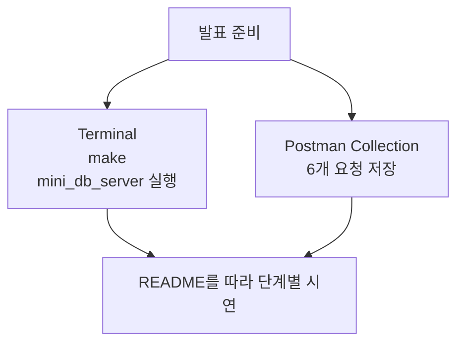

---

## Step 1. 프로젝트 소개

저희 팀은 기존 DB 엔진을 재사용하면서, 그 앞에 `mini_db_server`라는 HTTP API 서버를 추가했습니다.

핵심은 DB 엔진을 새로 만드는 것이 아니라, 이미 구현된 SQL 처리 흐름을 서버에서 안전하게 호출할 수 있도록 감싸는 것입니다.


### 기존 엔진 구성

| 계층 | 역할 |
| --- | --- |
| `lexer.c` | SQL 문자열을 token stream으로 변환 |
| `parser.c` | token stream을 `Statement` AST로 변환 |
| `executor.c` | INSERT/SELECT 실행 |
| `runtime.c` | `ExecutionContext`, `TableRuntime`, B+Tree index 관리 |
| `storage.c` | `.schema`, `.data` 파일 읽기/쓰기 |
| `bptree.c` | `id -> row_offset` in-memory index |

---

## Step 2. 주요 설계 의사결정

### 2-1. Raw TCP vs HTTP/JSON

처음에는 통신 방식을 raw TCP로 할지, HTTP/JSON으로 할지 고민했습니다.

Raw TCP는 직접 프로토콜을 설계할 수 있다는 장점이 있지만, 요청 구분 방식, 응답 포맷, 테스트 클라이언트까지 직접 정해야 합니다. 하루짜리 프로젝트 범위에서는 리스크가 큽니다.

그래서 최종적으로는 Postman으로 바로 테스트할 수 있고, 요청/응답 구조와 HTTP 상태 코드를 보여주기 쉬운 HTTP/JSON을 선택했습니다.

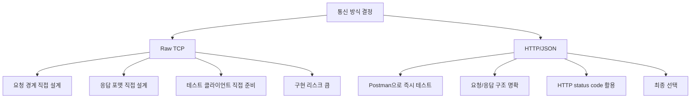

### 2-2. 요청당 SQL 1문장만 허용

한 요청에 여러 SQL을 담는 batch 방식도 고민했습니다. 하지만 batch를 허용하면 락 범위, 부분 실패 처리, 응답 형식이 한꺼번에 복잡해집니다.

예를 들어 첫 번째 INSERT는 성공했는데 두 번째 SELECT에서 실패하면 어디까지 성공으로 볼지, rollback을 할지, 응답을 배열로 만들지 같은 문제가 생깁니다.

그래서 이번 프로젝트에서는 요청당 SQL 1문장만 허용했습니다. 대신 여러 요청을 동시에 보내는 방식으로 병렬 처리와 동시성 제어를 검증했습니다.

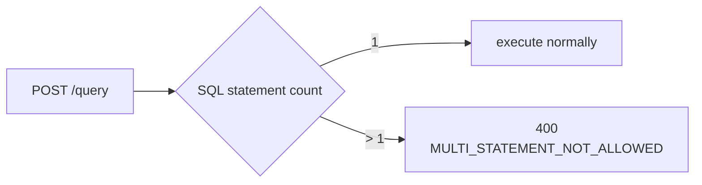

### 2-3. 동시성 검증 방식

단일 SQL만 허용해도 동시성 검증은 가능합니다. 동시성은 한 요청 안에 SQL이 여러 개 있는지보다, 여러 HTTP 요청이 동시에 들어오는지에서 발생합니다.

이번 발표에서는 Postman Performance Test로 여러 virtual user가 같은 요청을 병렬로 보내는 방식으로 read-read, write-write 상황을 확인합니다.

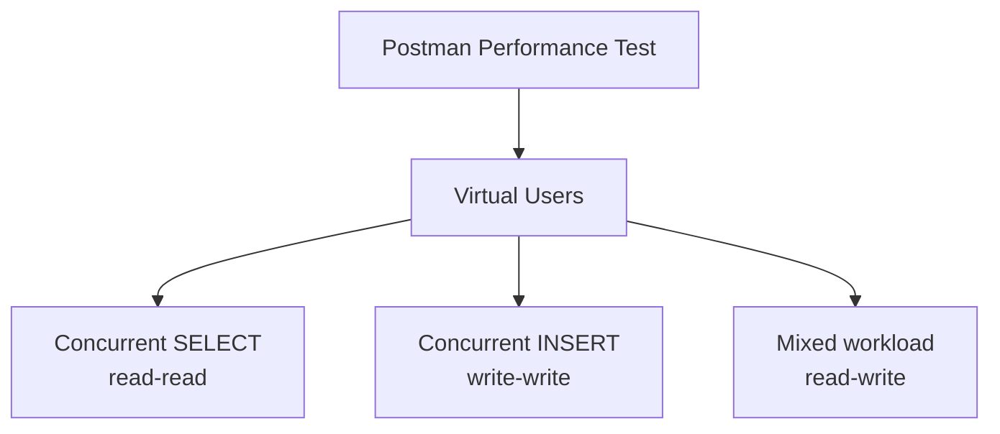

---

## Step 3. 아키텍처와 동시성 설계

### 3-1. 전체 구조

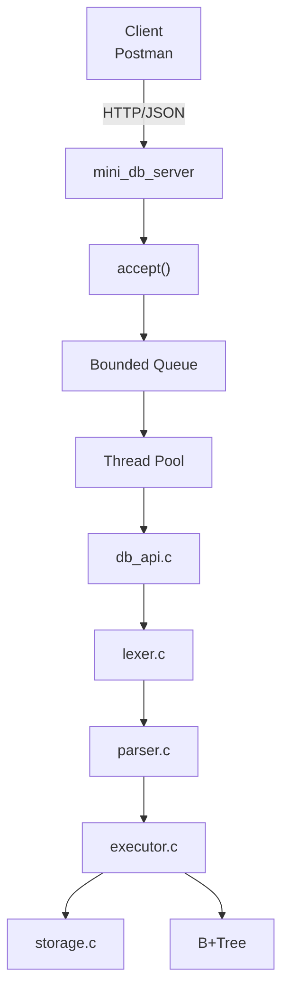

### 3-2. `db_api.c`의 역할

`db_api.c`는 새 SQL 실행기를 만드는 파일이 아닙니다. 기존 엔진을 API 서버에 연결하는 접착제 역할입니다.

문법 검사는 parser가 담당하고, `db_api.c`는 API 정책을 담당합니다.

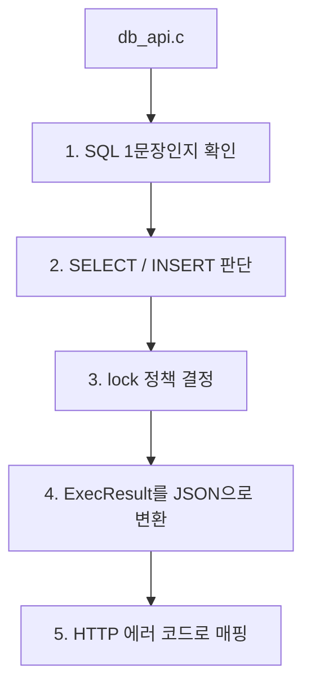

한 번 파싱해서 만든 `Statement *`를 정책 판단에도 사용하고, 그대로 `execute_statement()`에 넘겨 실행합니다.

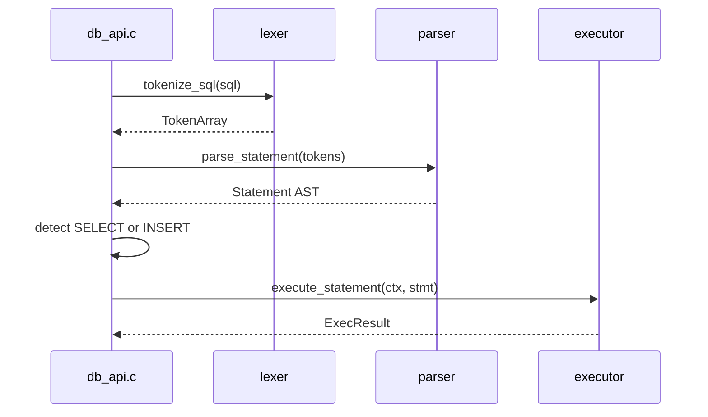

### 3-3. Lock 정책

동시성 쪽에서는 세 가지 선택지를 고민했습니다.

| 선택지 | 장점 | 문제 |
| --- | --- | --- |
| SELECT 완전 무잠금 | 가장 빠를 수 있음 | 첫 SELECT도 runtime cache를 수정할 수 있어 위험 |
| SELECT까지 write lock | 구현 단순 | DB 레벨에서 사실상 싱글 스레드 |
| SELECT preload 후 read lock, INSERT write lock | SELECT 병렬성과 INSERT 정합성 균형 | preload 단계가 필요 |

최종적으로 세 번째 방식을 선택했습니다.

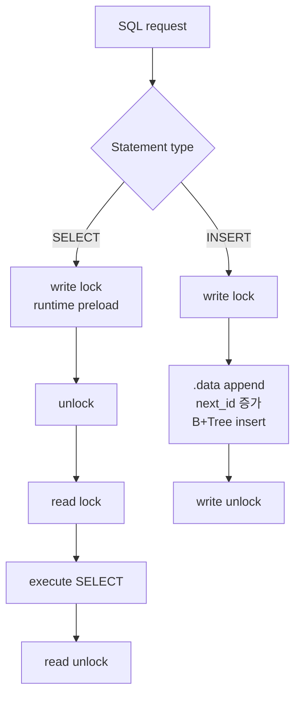

`get_or_load_table_runtime()`이 첫 접근 때 schema load, `.data` 파일 확인, B+Tree 재구성, runtime cache append를 수행할 수 있기 때문에 첫 SELECT도 완전 무잠금으로 둘 수 없습니다.


---

## Step 4. 서버 실행 시연

터미널에서 서버를 실행합니다.

```bash
./mini_db_server -d db -p 8080 -t 4 -q 64
```

| 옵션 | 의미 | 발표 기본값 |
| --- | --- | --- |
| `-d` | DB 디렉터리 | `db` |
| `-p` | 포트 | `8080` |
| `-t` | worker thread 수 | `4` |
| `-q` | queue capacity | `64` |

worker 수는 I/O-bound 서버라는 점을 고려했습니다. 네트워크 요청과 파일 I/O가 있기 때문에 CPU 코어 수와 정확히 같게 두기보다는, 4로 시작하고 8, 16, 32, 64를 benchmark로 비교할 수 있게 했습니다.

Queue도 64에서 시작하고 128, 256, 512, 1024 같은 값을 실험할 수 있게 했습니다. Queue에 상한을 둔 이유는 요청 폭주 시 메모리 사용량과 응답 지연이 계속 증가하는 것을 막기 위해서입니다.

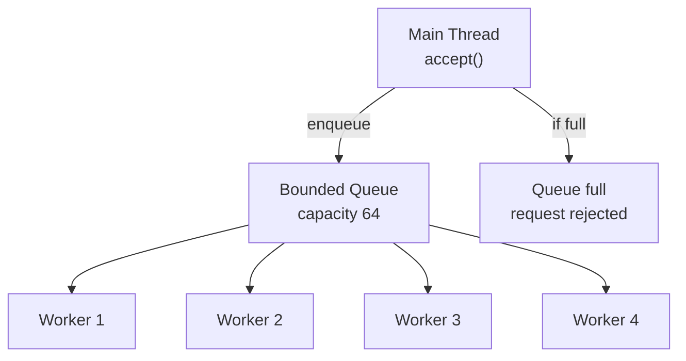

---

## Step 5. Postman 시연 1 - Health Check

Postman에서 아래 요청을 실행합니다.

```text
Method: GET
URL: http://127.0.0.1:8080/health
```

예상 응답:

```json
{
  "success": true,
  "service": "mini_db_server"
}
```

이 단계에서는 서버가 정상적으로 요청을 받고 JSON 응답을 주는지 확인합니다.

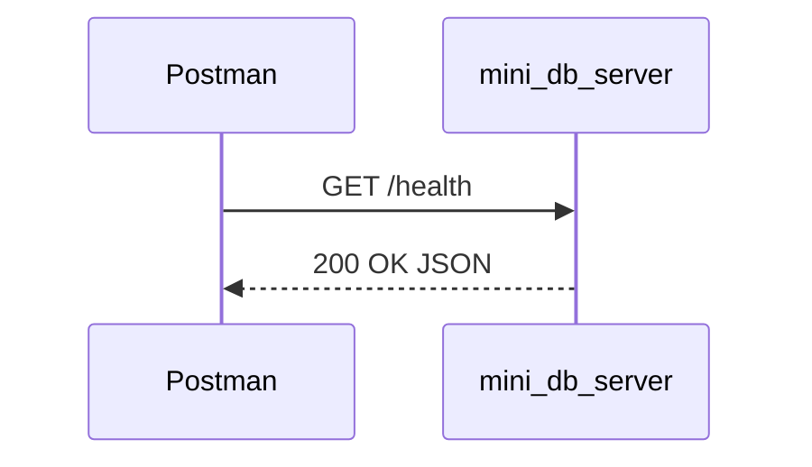

---

## Step 6. Postman 시연 2 - INSERT

Postman에서 아래 요청을 실행합니다.

```text
Method: POST
URL: http://127.0.0.1:8080/query

Headers:
Content-Type: application/json

Body -> raw -> JSON:
{
  "sql": "INSERT INTO users VALUES ('kim', 25);"
}
```

예상 응답:

```json
{
  "success": true,
  "type": "insert",
  "affected_rows": 1,
  "generated_id": 1
}
```

`users` 테이블은 `id` 컬럼이 있기 때문에 id는 사용자가 직접 넣지 않고, 기존 DB 엔진이 자동 생성합니다. 응답의 `generated_id`로 auto-id 정책이 API 서버에서도 그대로 동작하는 것을 확인합니다.

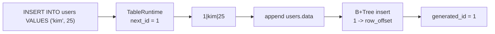

---

## Step 7. Postman 시연 3 - SELECT

Postman에서 아래 요청을 실행합니다.

```text
Method: POST
URL: http://127.0.0.1:8080/query

Headers:
Content-Type: application/json

Body -> raw -> JSON:
{
  "sql": "SELECT * FROM users WHERE id = 1;"
}
```

예상 응답:

```json
{
  "success": true,
  "type": "select",
  "used_index": true,
  "row_count": 1,
  "columns": ["id", "name", "age"],
  "rows": [["1", "kim", "25"]]
}
```

응답에서 중요한 부분은 `used_index: true`입니다. 이 값은 기존 B+Tree 인덱스를 통해 row 위치를 찾았다는 뜻입니다.

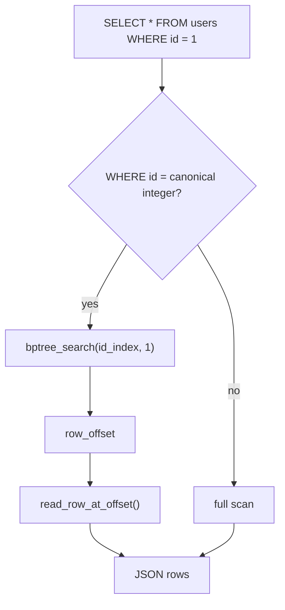

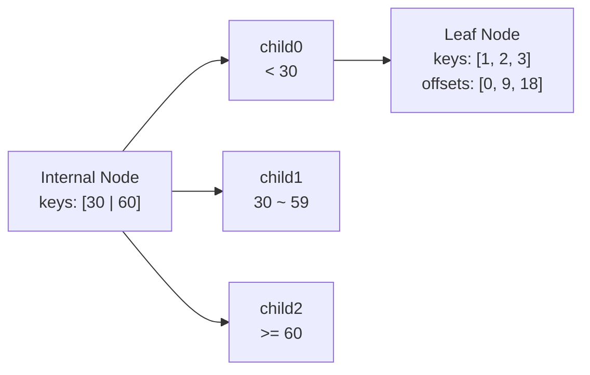

---

## Step 8. Postman 시연 4 - 단일 SQL 제한 확인

Postman에서 아래 요청을 실행합니다.

```text
Method: POST
URL: http://127.0.0.1:8080/query

Headers:
Content-Type: application/json

Body -> raw -> JSON:
{
  "sql": "SELECT * FROM users; SELECT * FROM users;"
}
```

예상 응답:

```json
{
  "success": false,
  "error_code": "MULTI_STATEMENT_NOT_ALLOWED",
  "message": "..."
}
```

이번 MVP에서는 요청당 SQL 1문장만 허용하기 때문에, 여러 statement가 들어오면 명확하게 에러를 반환합니다.

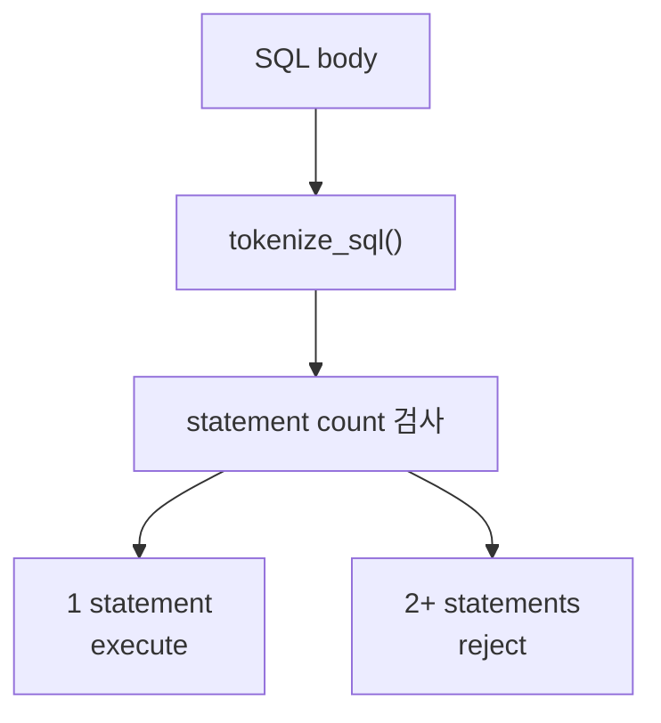

---

## Step 9. Postman 시연 5 - Concurrent SELECT

단일 SQL만 허용한다고 해서 동시성 검증을 못 하는 것은 아닙니다. 동시성은 한 요청 안의 SQL 개수가 아니라, 여러 요청이 동시에 들어오는지에서 발생합니다.

Postman Performance Test로 단일 SELECT 요청을 여러 개 동시에 보내 read-read 상황을 검증합니다.

```text
Postman Collection: Concurrent SELECT

Request:
Method: POST
URL: http://127.0.0.1:8080/query

Headers:
Content-Type: application/json

Body -> raw -> JSON:
{
  "sql": "SELECT * FROM users WHERE id = 1;"
}
```

Performance Test 설정:

```text
Virtual Users: 20
Duration: 10 seconds
Load Profile: Fixed
```

여러 SELECT가 동시에 들어와도 preload 이후 read lock으로 안정적으로 병렬 처리되는지 확인합니다.

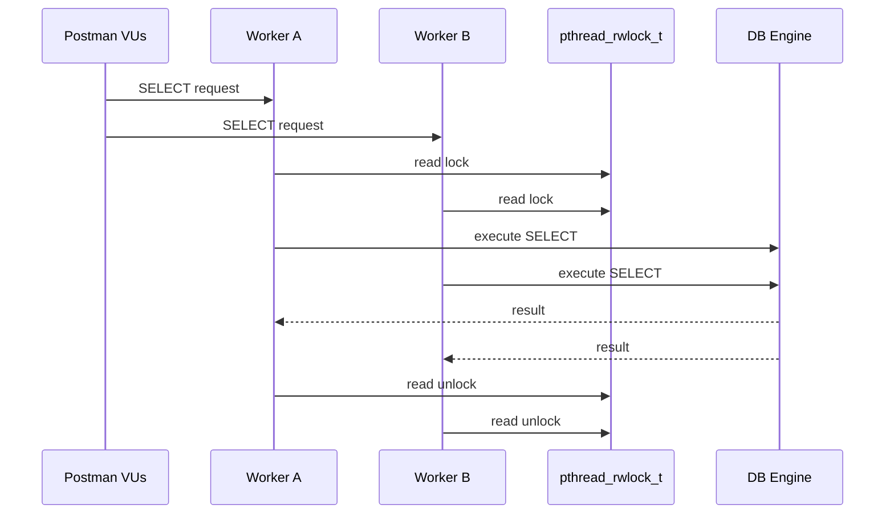

---

## Step 10. Postman 시연 6 - Concurrent INSERT

Postman Performance Test로 단일 INSERT 요청을 여러 개 동시에 보내 write-write 상황을 검증합니다.

```text
Postman Collection: Concurrent INSERT

Request:
Method: POST
URL: http://127.0.0.1:8080/query

Headers:
Content-Type: application/json

Body -> raw -> JSON:
{
  "sql": "INSERT INTO users VALUES ('postman_user', 20);"
}
```

Performance Test 설정:

```text
Virtual Users: 10
Duration: 10 seconds
Load Profile: Fixed
```

여러 INSERT가 동시에 들어와도 write lock 덕분에 `.data` append, `next_id`, B+Tree insert가 깨지지 않는지 확인합니다.

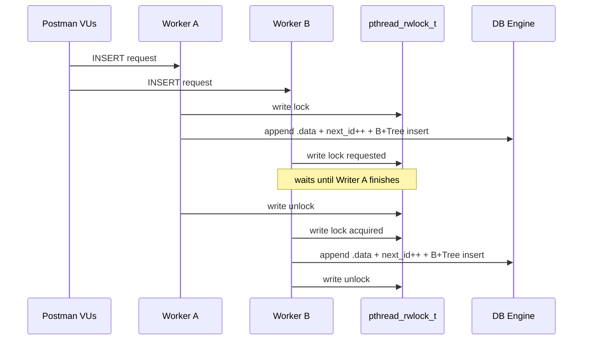

Postman Performance Test 결과 화면에서는 virtual users, requests per second, average response time, error rate 같은 지표를 확인할 수 있습니다.

---

## Step 11. 마무리

정리하면, 이 프로젝트는 기존 CLI 기반 SQL Processor를 HTTP/JSON API 서버로 확장한 작업입니다.

설계상 중요한 결정은 네 가지입니다.

1. Raw TCP가 아니라 HTTP/JSON을 선택해 테스트와 발표, 구현 난이도의 균형을 맞췄습니다.
2. 요청당 SQL 1문장만 허용해 batch 처리 복잡도를 줄이고, 병렬 처리와 동시성 제어에 집중했습니다.
3. 기존 lexer, parser, executor, runtime, storage, B+Tree를 그대로 재사용하고, `db_api.c`는 API 정책과 lock 제어를 담당하는 adapter로 분리했습니다.
4. `pthread_rwlock_t`를 사용해 SELECT는 preload 후 read lock, INSERT는 write lock으로 처리했습니다.

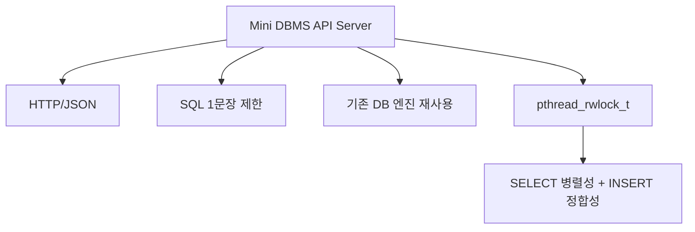

앞으로 개선한다면 SQL batch, `/stats`, table-level lock, 더 정교한 benchmark 기반 thread/queue 튜닝, UPDATE/DELETE까지 확장할 수 있습니다.

---

## Postman 시연 요청 모음

### 1. Health Check

```text
GET http://127.0.0.1:8080/health
```

### 2. INSERT

```text
POST http://127.0.0.1:8080/query
Content-Type: application/json

{
  "sql": "INSERT INTO users VALUES ('kim', 25);"
}
```

### 3. SELECT

```text
POST http://127.0.0.1:8080/query
Content-Type: application/json

{
  "sql": "SELECT * FROM users WHERE id = 1;"
}
```

### 4. Multi Statement Error

```text
POST http://127.0.0.1:8080/query
Content-Type: application/json

{
  "sql": "SELECT * FROM users; SELECT * FROM users;"
}
```

### 5. Concurrent SELECT

```text
Postman Performance Test

Request:
POST http://127.0.0.1:8080/query

Body:
{
  "sql": "SELECT * FROM users WHERE id = 1;"
}

Virtual Users: 20
Duration: 10 seconds
Load Profile: Fixed
```

### 6. Concurrent INSERT

```text
Postman Performance Test

Request:
POST http://127.0.0.1:8080/query

Body:
{
  "sql": "INSERT INTO users VALUES ('postman_user', 20);"
}

Virtual Users: 10
Duration: 10 seconds
Load Profile: Fixed
```

---

## QnA 대비 답변

### Q. 왜 TCP가 아니라 HTTP/JSON인가요?

Raw TCP는 직접 요청 구분 방식과 응답 포맷을 설계해야 해서 구현과 설명 비용이 큽니다. 이번 프로젝트는 하루 안에 API 서버, Thread Pool, DB 엔진 연동, 동시성 제어를 보여주는 것이 핵심이었기 때문에, Postman으로 바로 테스트 가능하고 요청/응답 구조가 명확한 HTTP/JSON을 선택했습니다.

### Q. 단일 SQL만 받으면 동시성 검증이 약하지 않나요?

아닙니다. 동시성은 한 요청 안의 SQL 개수가 아니라 여러 요청이 동시에 들어올 때 발생합니다. Postman Performance Test로 단일 SELECT 요청 여러 개, 단일 INSERT 요청 여러 개, 그리고 SELECT/INSERT mixed workload를 동시에 보내 read-read, write-write, read-write 상황을 검증했습니다.

### Q. 왜 SELECT를 완전 무잠금으로 두지 않았나요?

기존 엔진은 첫 테이블 접근 때 `get_or_load_table_runtime()`에서 schema load, `.data` 확인, B+Tree rebuild, runtime cache append를 수행할 수 있습니다. 즉 첫 SELECT도 shared state를 수정할 수 있기 때문에 완전 무잠금 SELECT는 위험합니다.

### Q. 왜 mutex 하나가 아니라 rwlock인가요?

Mutex 하나로 전체 DB를 보호하면 구현은 쉽지만 SELECT도 모두 직렬화되어 DB 레벨에서는 싱글 스레드처럼 동작합니다. rwlock을 쓰면 여러 SELECT는 동시에 처리하고, INSERT만 단독 처리할 수 있어서 병렬성과 정합성을 모두 설명할 수 있습니다.

### Q. 왜 queue에 상한을 뒀나요?

상한이 없는 queue는 요청 폭주 시 메모리 사용량과 대기 시간이 계속 증가합니다. 최악의 경우 서버가 불안정해질 수 있습니다. 그래서 Bounded Queue를 두고, queue가 꽉 차면 503으로 거절하는 방식으로 시스템 안정성을 확보했습니다.

## 참고

- [Configure and run performance tests in Postman](https://learning.postman.com/docs/collections/performance-testing/performance-test-configuration/)
- [View metrics for performance tests in Postman](https://learning.postman.com/docs/collections/performance-testing/performance-test-metrics/)
