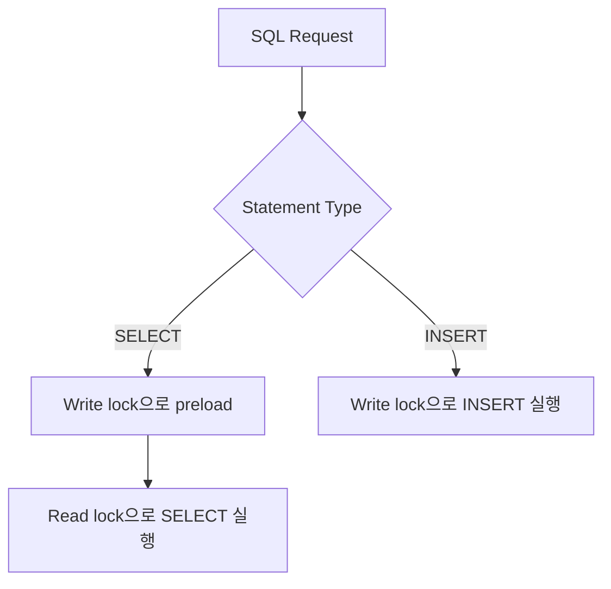

# Mini DBMS API Server

기존 C 기반 SQL 엔진 위에 최소 HTTP/JSON API 서버를 붙인 프로젝트입니다.

- CLI SQL 실행기: `sql_processor`
- HTTP API 서버: `mini_db_server`
- 지원 SQL: `SELECT`, `INSERT`
- 요청 제한: HTTP 요청 1개당 SQL 1문장

## 1. 프로젝트 소개

- 기존 `lexer`, `parser`, `executor`, `storage`, `B+Tree`를 재사용합니다.
- 새로 추가한 핵심은 HTTP 서버, thread pool, bounded queue, `db_api.c`입니다.
- 목표는 기능 확장보다 `API 서버 연결`, `병렬 요청 처리`, `동시성 제어`를 보여주는 것입니다.


### 핵심 포인트

- `SELECT ... WHERE id = ?`는 B+Tree 인덱스를 사용할 수 있습니다.
- `INSERT`는 auto-increment id를 생성하고 `.data`와 인덱스를 함께 갱신합니다.
- main thread는 `accept()`와 queue 적재만 담당합니다.
- 실제 HTTP 처리와 SQL 실행은 worker thread가 담당합니다.

## 2. 주요 설계 의사결정

### 통신 방식

- `raw TCP` 대신 `HTTP/JSON`을 선택했습니다.
- 이유:
  - 요청과 응답 형식이 명확합니다.
  - `curl`, Postman 같은 도구로 바로 테스트할 수 있습니다.
  - HTTP status code로 에러를 설명하기 쉽습니다.

### 요청당 SQL 개수

- 요청당 SQL 1문장만 허용합니다.
- 이유:
  - batch를 허용하면 부분 성공, 부분 실패, 응답 형식이 복잡해집니다.
  - MVP 범위에서는 병렬 처리와 동시성 제어에 집중하는 편이 낫다고 판단했습니다.

### `db_api.c` 역할

- `db_api.c`는 새 SQL 엔진이 아닙니다.
- 역할:
  - SQL 1문장인지 확인
  - `SELECT` / `INSERT` 구분
  - lock 정책 적용
  - `ExecResult`를 JSON으로 변환
  - 내부 오류를 HTTP 상태 코드와 에러 코드로 매핑

## 3. 아키텍처와 동시성

### 요청 처리 흐름

- main thread
  - `accept()`로 연결을 받습니다.
  - client fd를 bounded queue에 넣습니다.
- worker thread
  - queue에서 작업을 꺼냅니다.
  - HTTP 요청을 읽습니다.
  - JSON body에서 `sql` 필드를 추출합니다.
  - `db_api.c`를 통해 기존 SQL 엔진을 호출합니다.
  - JSON 응답을 만들어 클라이언트에 반환합니다.

### 주요 파일

| 파일 | 역할 |
| --- | --- |
| `src/server_main.c` | 서버 옵션 파싱, 기본값 설정 |
| `src/server.c` | 소켓 accept, queue 제출, `/health`, `/query`, `QUEUE_FULL` 처리 |
| `src/thread_pool.c` | worker thread 생성과 작업 실행 |
| `src/task_queue.c` | bounded queue 구현 |
| `src/db_api.c` | SQL 검증, lock 정책, JSON 응답 생성 |
| `src/http.c` | 최소 HTTP 요청/응답 처리 |
| `src/json_parser.c` / `src/json_writer.c` | JSON 요청 파싱 / 응답 생성 |
| `src/lexer.c` / `src/parser.c` / `src/executor.c` | SQL 토큰화 / AST 생성 / 실행 |
| `src/runtime.c` | table runtime cache, preload, `next_id`, id index 관리 |
| `src/storage.c` / `src/bptree.c` | 파일 입출력 / B+Tree 인덱스 |

### Queue 정책

- queue는 bounded queue입니다.
- 기본 queue capacity는 서버 실행 기준 `64`입니다.
- queue가 가득 차면 서버는 `503`과 `QUEUE_FULL`을 반환합니다.
- 무제한 queue보다 메모리 사용량과 지연을 통제하기 쉽습니다.

### Worker 기본값

- 서버 실행 기본값은 `worker 4개`, `queue 64`입니다.
- 이 값은 코드 기본값이며, [src/server_main.c](/Users/liamtsy/Desktop/krafton_jungle/W08/Threaded_DB-API_Server/src/server_main.c:64) 기준으로 설정됩니다.
- 최적값이라고 단정하지 않고, benchmark로 비교 가능한 출발점으로 사용합니다.

### Lock 정책



- `SELECT`
  - 먼저 write lock으로 table runtime preload를 수행합니다.
  - 그다음 read lock으로 실제 조회를 실행합니다.
- `INSERT`
  - write lock으로 실행합니다.
  - `.data` append, `next_id` 증가, B+Tree 갱신을 한 번에 보호합니다.

### 왜 preload가 필요한가

- 쉽게 말하면, 처음 읽는 테이블은 조회 전에 준비 작업이 필요합니다.
- 이때 여러 `SELECT`가 동시에 처음 들어오면 같은 준비 작업을 여러 번 하거나, 공유 캐시를 동시에 건드릴 수 있습니다.
- 그래서 처음 준비 단계는 잠깐 쓰기 잠금으로 막아 한 번만 안전하게 끝내고, 준비가 끝난 뒤에는 읽기 잠금으로 여러 조회를 같이 실행합니다.
- 이 준비 작업에는 아래 내용이 포함될 수 있습니다.
  - schema 읽기
  - `.data` 확인
  - B+Tree 다시 만들기
  - 공유 캐시에 등록
- 그래서 완전 무잠금 `SELECT`는 쓰지 않고, preload 후 read lock 정책을 사용합니다.

### 왜 `pthread_rwlock_t`인가

- mutex 하나로 전체 DB를 보호하면 `SELECT`도 모두 직렬화됩니다.
- `pthread_rwlock_t`를 쓰면:
  - 여러 `SELECT`는 read lock으로 같이 실행할 수 있습니다.
  - `INSERT`는 write lock으로 단독 실행됩니다.
- 즉, 구현 단순성과 병렬성 사이에서 균형을 잡기 위한 선택입니다.

## 4. 실행과 API

### Build

```bash
make
```

생성 파일:

- `./sql_processor`
- `./mini_db_server`
- `./build/test_*`
- `./build/benchmark_bptree`
- `./build/*.o`

### Test

```bash
make test
```

포함 내용:

- 엔진 단위 테스트
- API 서버 쉘 테스트
- 통합 테스트

### CLI 사용

```bash
./sql_processor -d db -f queries/multi_statements.sql
```

예시 SQL:

```sql
INSERT INTO users VALUES ('Alice', 20);
SELECT * FROM users WHERE id = 1;
```

### API 서버 실행

```bash
./mini_db_server -d db -p 8080 -t 4 -q 64
```

### 옵션

| 옵션 | 의미 | 기본값 |
| --- | --- | --- |
| `-d`, `--db` | DB 디렉터리 | 필수 |
| `-p`, `--port` | 포트 | `8080` |
| `-t`, `--threads` | worker thread 수 | `4` |
| `-q`, `--queue-size` | queue capacity | `64` |
| `-h`, `--help` | 도움말 | 없음 |

### `GET /health`

```bash
curl -s http://127.0.0.1:8080/health | jq
```

응답 예시:

```json
{
  "success": true,
  "service": "mini_db_server"
}
```

### `POST /query`

요청 형식:

```json
{
  "sql": "SELECT * FROM users WHERE id = 1;"
}
```

INSERT 예시:

```bash
curl -s -X POST http://127.0.0.1:8080/query \
  -H "Content-Type: application/json" \
  --data '{"sql":"INSERT INTO users VALUES ('\''Alice'\'', 20);"}' | jq
```

SELECT 예시:

```bash
curl -s -X POST http://127.0.0.1:8080/query \
  -H "Content-Type: application/json" \
  --data '{"sql":"SELECT * FROM users WHERE id = 1;"}' | jq
```

응답 예시는 fresh DB 또는 테스트용 빈 `users.data` 기준입니다.

INSERT 응답 예시:

```json
{
  "success": true,
  "type": "insert",
  "affected_rows": 1,
  "generated_id": 1
}
```

SELECT 응답 예시:

```json
{
  "success": true,
  "type": "select",
  "used_index": true,
  "row_count": 1,
  "columns": ["id", "name", "age"],
  "rows": [["1", "Alice", "20"]]
}
```

에러 응답 예시:

```json
{
  "success": false,
  "error_code": "MULTI_STATEMENT_NOT_ALLOWED",
  "message": "only one SQL statement is allowed"
}
```

### 지원 범위

지원:

- `GET /health`
- `POST /query`
- JSON body의 top-level `sql` 문자열
- 요청당 SQL 1문장
- `SELECT`
- `INSERT`
- `WHERE id = ?` 조회
- B+Tree 인덱스 기반 id 조회

미지원:

- SQL batch
- `UPDATE`
- `DELETE`
- `JOIN`
- transaction
- full HTTP/1.1 기능
- chunked body

## 5. 시행착오와 배운 점

이 섹션은 현재 기본 구현과 별도로, 프로젝트를 진행하면서 확인한 시행착오를 요약한 것입니다.


### 기본 구현에서 확인한 점

- 처음 가설:
  - 멀티스레딩이면 worker를 늘릴수록 더 빨라질 것이라고 생각했습니다.
- 실제 관찰:
  - worker를 늘려도 항상 성능이 좋아지지 않았습니다.
  - 어떤 조합에서는 worker가 적은 쪽이 더 빨랐습니다.
- 이유:
  - 현재 기본 구현은 정합성을 우선한 전역 `pthread_rwlock_t` 기반입니다.
  - `INSERT`는 write lock으로 직렬화됩니다.
  - `SELECT`도 preload 단계에서 write lock을 한 번 거치지만, 이 구간은 짧아서 그 자체가 항상 큰 손해로 나타난 것은 아니었습니다.
  - 오히려 worker 수를 늘릴수록 queue 관리, lock 경쟁, context switch 같은 오버헤드가 더 커졌습니다.
  - 그래서 workload가 짧으면 SQL 실행 시간보다 이런 오버헤드가 더 크게 보일 수 있습니다.

### 여기서 배운 점

- 멀티스레딩은 무조건 더 빠른 기술이 아닙니다.
- 속도는 thread 수보다 락을 거는 범위, 공유 상태, 작업 길이에 더 크게 영향을 받습니다.
- 서버에서 멀티스레딩의 가치는 단일 요청 1개를 극단적으로 빠르게 끝내는 것보다, 여러 요청을 동시에 받아도 시스템이 버티게 하는 데 더 가깝습니다.
- 성능 benchmark에서 병렬성이 좋아졌다는 사실만으로, 현재 코드베이스의 정합성까지 자동으로 증명되는 것은 아닙니다.

### 후속 실험

- 별도 실험에서는 lock 범위를 더 좁히는 방식도 검토했습니다.
- 그 경우 서로 덜 충돌하는 요청이 동시에 통과할 수 있어서, worker 수가 많은 구성이 더 유리한 결과도 확인했습니다.
- 이 결과는 "전역 lock contention이 실제 병목이었다"는 점을 보여주는 성능 실험으로는 의미가 있습니다.
- 하지만 현재 엔진의 write path는 단일 row만 수정하는 것이 아니라 `.data` append, `next_id` 증가, in-memory B+Tree 갱신, runtime cache 재사용 같은 더 넓은 공유 상태를 함께 다룹니다.
- 따라서 row-level에 가까운 더 잘게 나눈 락이 성능상 이점이 있더라도, 현재 코드 구조에서 바로 기본 구현으로 채택하면 정합성 설명과 검증 비용이 크게 증가합니다.
- 그래서 기본 구현은 정합성을 우선한 전역 `rwlock` 기반 MVP로 유지했고, 더 잘게 나눈 락 방식은 별도 자료구조 설계와 정합성 검증이 필요한 후속 과제로 남겼습니다.

## 6. Benchmark

벤치마크 스크립트:

```bash
sh tests/bench_api_server.sh
```

스크립트 기본값:

- 요청 수: 케이스당 `1000`
- 반복 횟수: `3`
- 동시 요청 수: `32`
- worker 후보: `2 4 8`
- queue 후보: `32 64 128`
- workload: `select-only`, `insert-only`, `mixed`

결과 파일:

- `build/bench_api_server_results.tsv`
- `build/bench_api_server_runs.tsv`

예시:

```bash
REQUESTS_PER_RUN=200 RUNS_PER_CASE=2 CONCURRENCY=16 \
WORKERS_LIST="1 2 4 8" QUEUE_SIZES="32 64" WORKLOADS="mixed" \
SEED_ROWS=5000 sh tests/bench_api_server.sh
```

## 제한 사항

- 구현 범위는 MVP에 맞춰 좁게 유지했습니다.
- 쓰기 작업은 넓은 범위를 한 번에 잠그는 방식으로 보호합니다.
- 읽기 처리 흐름도 preload 단계에서는 쓰기 잠금을 사용합니다.
- 더 잘게 나눈 락 실험은 병렬성 향상 가능성을 보여줬지만, 현재 엔진의 `next_id`, `.data` append, B+Tree, 공유 캐시까지 함께 안전하게 보호하는 구조로는 아직 일반화하지 않았습니다.
- 작업이 매우 짧으면 스레드, 큐, 락 오버헤드가 더 크게 보일 수 있습니다.

## 참고

- [Postman Performance Testing Docs](https://learning.postman.com/docs/collections/performance-testing/performance-test-configuration/)
- [Postman Performance Metrics Docs](https://learning.postman.com/docs/collections/performance-testing/performance-test-metrics/)
