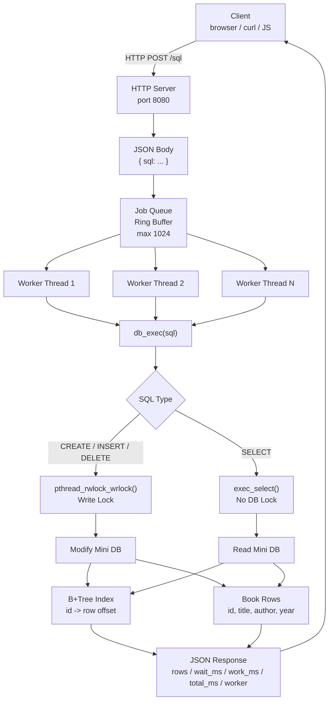

# Threaded DB API Server 명세서

## 1. 프로젝트 개요

이 프로젝트는 C 언어로 구현한 미니 DBMS API 서버이다.

클라이언트가 HTTP/JSON으로 SQL을 보내면 서버가 작업을 Queue에 넣고, Thread Pool의 worker가 SQL을 처리한 뒤 JSON 응답을 돌려준다.

```text
client(http/js)
-> server
-> queue
-> thread pool
-> SQL + B+ tree mini DB
-> server
-> client
```

## 2. 목표

- HTTP/JSON 기반 DB API 서버 구현
- worker thread 기반 병렬 요청 처리
- 고정 크기 작업 큐 구현
- 기존 B+Tree 코드 재사용
- books 테이블 전용 SQL 처리
- 요청별 대기 시간, 처리 시간, 전체 시간 측정
- worker 수별 READ / WRITE / MIXED 성능 비교
- JS benchmark와 Canvas chart 제공
- 단위 테스트, API 테스트, CI 제공

## 3. 실행 구조

### 3.1 main thread

역할:

- TCP socket 생성
- HTTP request accept
- HTTP header/body 읽기
- route 분기
- JSON body에서 SQL 추출
- Queue에 Job push

파일:

- `src/server_main.c`
- `src/http.c`

### 3.2 Queue

역할:

- main thread와 worker thread 사이의 작업 버퍼
- 고정 크기 ring buffer
- Queue가 비면 worker는 condition variable에서 대기
- Queue가 가득 차면 요청을 오래 붙잡지 않고 503 반환

설정:

```text
QUEUE_MAX = 1024
```

파일:

- `include/queue.h`
- `src/queue.c`

### 3.3 Thread Pool

역할:

- worker thread를 미리 생성
- Queue에서 Job pop
- SQL 또는 benchmark 실행
- 응답 JSON 작성
- client socket에 response 전송

worker 설정:

```bash
./server --port 8080 --workers 8
```

기본값:

```text
CPU core 수 * 2
```

CPU core 수를 가져올 수 없는 환경에서는 기본 worker 수를 2로 둔다.

파일:

- `include/pool.h`
- `src/pool.c`

## 4. HTTP API 명세

### 4.1 Health

요청:

```http
GET /health
```

응답:

```json
{"ok":true}
```

### 4.2 SQL 실행

요청:

```http
POST /sql
Content-Type: application/json

{"sql":"SELECT * FROM books WHERE id = 1;"}
```

성공 응답 예:

```json
{
  "ok": true,
  "rows": [
    {"id":1,"title":"C Book","author":"Kim","year":2024}
  ],
  "truncated": false,
  "wait_ms": 0.1,
  "work_ms": 0.02,
  "total_ms": 0.2,
  "worker": 1
}
```

실패 응답 예:

```json
{
  "ok": false,
  "err": "bad sql",
  "wait_ms": 0.1,
  "work_ms": 0.02,
  "total_ms": 0.2,
  "worker": 1
}
```

### 4.3 Stats

요청:

```http
GET /stats
```

응답:

```json
{
  "workers": 8,
  "queue_now": 0,
  "queue_max": 1024,
  "done": 10
}
```

### 4.4 Benchmark

요청:

```http
POST /bench
Content-Type: application/json

{"mode":"write","count":1000}
```

응답:

```json
{
  "ok": true,
  "mode": "write",
  "count": 1000,
  "workers": 8,
  "qps": 10000.0,
  "avg_wait_ms": 0.0,
  "avg_work_ms": 0.01,
  "total_ms": 100.0,
  "worker": 1
}
```

### 4.5 Chart

요청:

```http
GET /chart
```

응답:

```text
bench/chart.html
```

## 5. HTTP 제한 사항

- 한 연결에서 요청 1개만 처리
- chunked request 미지원
- `Content-Length` 기반 body 읽기
- body 최대 8192 bytes
- SQL 최대 2048 bytes
- 너무 큰 body는 413
- Queue full은 503
- 잘못된 요청은 400
- 모든 JSON 응답에 CORS header 포함

## 6. DB 명세

### 6.1 테이블

```text
books
```

### 6.2 컬럼

```text
id
title
author
year
```

### 6.3 지원 SQL

```sql
CREATE TABLE books;
INSERT INTO books VALUES (1, 'title', 'author', 2024);
SELECT * FROM books WHERE id = 1;
SELECT * FROM books;
DELETE FROM books WHERE id = 1;
```

### 6.4 SQL 처리 정책

- 완전한 SQL 엔진이 아니라 과제에 필요한 books SQL 부분집합만 지원한다.
- 서버의 DB 진입점은 `db_exec()` 하나로 둔다.
- 기존 B+Tree 구현을 `id -> row offset` 인덱스로 재사용한다.
- row 데이터는 프로세스 메모리에 저장한다.
- DELETE는 row를 tombstone 처리한 뒤 살아있는 row 기준으로 B+Tree를 재빌드한다.

파일:

- `include/db_api.h`
- `src/db_api.c`
- `include/bptree.h`
- `src/bptree.c`

## 7. 동시성 정책

### 7.1 SELECT

```text
SELECT -> lock 없이 바로 읽기
```

이유:

- SELECT는 DB 구조를 바꾸지 않는다.
- 읽기 요청끼리는 worker thread에서 바로 병렬 실행될 수 있다.
- 과제 정책에 맞춰 read lock을 걸지 않는다.

### 7.2 WRITE

```text
CREATE / INSERT / DELETE -> pthread_rwlock_wrlock()
```

이유:

- WRITE는 row 저장소와 B+Tree 구조를 바꾼다.
- INSERT 중 배열 확장과 B+Tree split이 발생할 수 있다.
- DELETE는 tombstone과 index rebuild를 수행한다.
- 따라서 write 요청은 단독 실행해야 한다.

## 8. 성능 측정 값

worker는 각 요청마다 아래 값을 측정한다.

```text
wait_ms  = worker가 작업을 시작한 시간 - queue에 들어온 시간
work_ms  = SQL 처리 완료 시간 - SQL 처리 시작 시간
total_ms = 응답 직전 시간 - queue에 들어온 시간
```

응답에는 처리한 worker 번호도 포함한다.

```json
{
  "worker": 3
}
```

## 9. Benchmark 명세

### 9.1 실행

대규모 실행:

```bash
make bench COUNT=1000000
```

빠른 확인:

```bash
make bench COUNT=10000
```

직접 실행:

```bash
node bench/bench.js --workers 1,2,4,8,16,32 --count 1000000 --conc 128
```

### 9.2 측정 모드

- `write`: INSERT만 실행
- `read`: SELECT만 실행
- `mixed`: INSERT와 SELECT를 섞어서 실행

### 9.3 결과 파일

```text
bench/result.json
```

형식:

```json
[
  {
    "workers": 1,
    "mode": "write",
    "count": 1000000,
    "conc": 128,
    "total_ms": 100000,
    "avg_wait_ms": 5.1,
    "avg_work_ms": 1.2,
    "qps": 10000
  }
]
```

### 9.4 Chart

파일:

```text
bench/chart.html
```

차트:

- worker 개수별 total time
- worker 개수별 avg wait time
- worker 개수별 avg work time
- worker 개수별 QPS

## 10. 테스트 명세

### 10.1 단위 테스트

명령:

```bash
make test
```

주요 테스트:

- B+Tree insert/search/duplicate
- Queue push/pop/full/empty
- SQL create/insert/select/delete
- 빈 SQL
- 잘못된 SQL
- 긴 SQL
- 없는 id 검색
- 중복 id INSERT
- DELETE 없는 id
- title/author 공백 포함

### 10.2 API 테스트

명령:

```bash
make api-test
```

검증:

- `GET /health`
- `POST /sql` CREATE
- `POST /sql` INSERT
- `POST /sql` SELECT
- `POST /sql` DELETE
- `GET /stats`
- bad JSON
- bad SQL
- 동시 SELECT 120개
- `POST /bench`

## 11. 빌드와 실행 명령

### 11.1 빌드

```bash
make clean
make
```

### 11.2 서버 실행

```bash
make run PORT=8080 WORKERS=8
```

또는:

```bash
./server --port 8080 --workers 8
```

### 11.3 직접 요청

```bash
curl http://127.0.0.1:8080/health
```

```bash
curl -X POST http://127.0.0.1:8080/sql \
  -H 'Content-Type: application/json' \
  -d '{"sql":"CREATE TABLE books;"}'
```

```bash
curl -X POST http://127.0.0.1:8080/sql \
  -H 'Content-Type: application/json' \
  -d "{\"sql\":\"INSERT INTO books VALUES (1, 'C Book', 'Kim', 2024);\"}"
```

```bash
curl -X POST http://127.0.0.1:8080/sql \
  -H 'Content-Type: application/json' \
  -d '{"sql":"SELECT * FROM books WHERE id = 1;"}'
```

## 12. CI/CD

GitHub Actions:

```text
.github/workflows/ci.yml
```

실행 항목:

- build
- unit test
- API test

## 13. 현재 한계

- 완전한 SQL 문법은 지원하지 않는다.
- DB는 메모리 기반이라 서버 종료 시 데이터가 사라진다.
- chunked request는 지원하지 않는다.
- 한 연결에서 요청 1개만 처리한다.
- SELECT는 과제 정책에 따라 lock 없이 읽으므로 write와 동시에 실행될 때 강한 snapshot isolation은 제공하지 않는다.
- DELETE는 B+Tree delete 함수가 없어 index rebuild 방식으로 처리한다.

## 14. Mermaid 구조도


