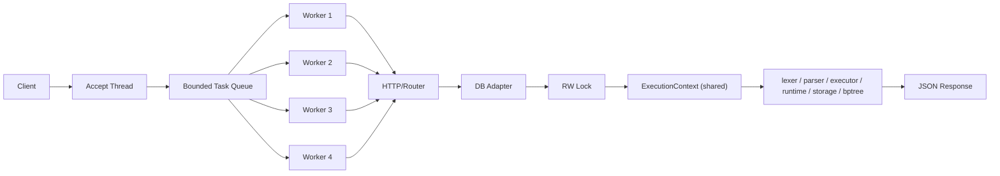
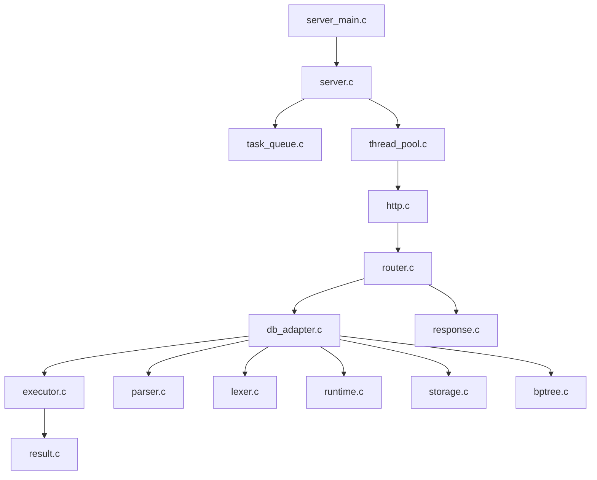

# 미니 DBMS - API 서버 최소 구현 계획

## 1. 이번 과제의 핵심을 3줄로 정의

이 레포지토리의 핵심 자산은 이미 구현되어 있는 SQL 엔진이다. 이번 과제의 MVP는 이 엔진을 버리지 않고, 그 위에 최소한의 HTTP/JSON 서버를 얹는 것이다.

스레드 풀로 요청은 병렬 처리하되, DB 상태 변경은 안전해야 한다. 그래서 발표 메시지는 "읽기는 동시에, 쓰기는 직렬화"로 잡는다.

하루짜리 4인 프로젝트이므로 서버 기능은 `GET /health`, `POST /query` 두 개로 끝내고, 과한 웹 기능 대신 기존 엔진 재사용, 동시성 제어, 발표 가능한 검증에 집중한다.

## 2. 요구사항 해석 결과: 반드시 들어가야 하는 최소 기능

아래는 이번 MVP에서 "없으면 과제 핵심을 못 했다고 보는 것"들이다.

| 구분 | 반드시 구현할 내용 |
| --- | --- |
| 서버 | C 기반 TCP 서버 + 최소 HTTP 파싱 |
| 요청/응답 | `HTTP + JSON` |
| 엔드포인트 | `GET /health`, `POST /query` |
| SQL 실행 | 현재 레포의 `lexer -> parser -> executor -> runtime -> storage` 재사용 |
| SQL 범위 | 현재 엔진이 안정적으로 지원하는 `INSERT`, `SELECT`, `WHERE column = literal` |
| 동시성 | Thread Pool + 작업 큐 |
| 동기화 | `INSERT`는 전역 write lock, `SELECT`는 병렬 허용 |
| 응답 | JSON 직렬화 |
| 검증 | 기능 테스트 + 동시성 테스트 + 발표용 데모 스크립트 |

이번 레포를 실제로 확인한 결과, 이미 다음이 구현되어 있다.

- `src/lexer.c`, `src/parser.c`, `src/executor.c`, `src/runtime.c`, `src/storage.c`, `src/bptree.c`
- `tests/`에 단위 테스트와 통합 테스트
- `tools/benchmark_bptree.c`, `src/benchmark.c`로 인덱스 성능 측정 도구

즉 이번 서버 과제는 "DB 엔진을 새로 만드는 일"이 아니라 "기존 엔진을 안전하게 외부 API로 감싸는 일"로 정의하는 것이 맞다.

## 3. 이번 1차 결과물에서 의도적으로 제외할 기능

하루짜리 프로젝트 기준으로 아래는 제외한다.

| 제외 항목 | 제외 이유 |
| --- | --- |
| 완전한 HTTP/1.1 구현 | 과제 핵심이 아니다. keep-alive, chunked, pipelining까지 가면 범위가 급격히 커진다. |
| 완전한 JSON 파서 | C에서 비용이 크다. 이번엔 top-level `sql` 필드만 읽는 제한 파서로 충분하다. |
| 다중 API 설계 | CRUD를 REST로 나누지 않는다. SQL 문자열을 전달하는 `POST /query` 하나로 끝낸다. |
| API에서 다중 SQL 문장 실행 | 기존 CLI는 여러 문장을 처리하지만, API는 한 요청 = 한 문장으로 제한하는 편이 훨씬 단순하다. |
| 인증/인가 | 과제 범위 밖이다. |
| 트랜잭션, rollback | 하루 안에 구현/검증하기 어렵다. |
| JOIN, UPDATE, DELETE 확장 | 기존 엔진 범위를 넘기면 서버보다 SQL 구현이 본체가 된다. |
| 동적 스케일링, 자동 튜닝 | 이번에는 상수 값을 정하고 검증하는 수준이 적절하다. |
| 웹 프론트엔드 | `curl`과 로그만으로도 발표 가능하다. |
| lock-free 자료구조 | 설명 난이도 대비 얻는 이득이 작다. |

쉽게 말하면, 이번 과제는 "작은 DB API 서버를 정확하게 끝내는 것"이지 "작은 데이터베이스 회사처럼 모든 기능을 다 흉내 내는 것"이 아니다.

## 4. GUIDE 기준으로 압축한 핵심 기능 3개와 핵심 블록 3개

### 핵심 기능 3개

1. 기존 SQL 엔진을 `POST /query`로 호출할 수 있어야 한다.
2. 여러 요청을 Thread Pool로 병렬 처리할 수 있어야 한다.
3. 동시 `INSERT`에서도 데이터와 인덱스가 깨지지 않아야 한다.

### 핵심 블록 3개

1. 네트워크 계층: 소켓, 최소 HTTP 파서, JSON 요청/응답
2. 병렬 처리 계층: accept loop, task queue, worker thread
3. DB 연결 계층: 기존 SQL 엔진 재사용 + 락 정책 + 결과 직렬화

이 세 블록만 제대로 세우면 발표에서 구조 설명도 쉽고, 구현 범위도 통제된다.

## 5. 최소 결과물의 형태

최소 결과물은 아래 기준을 만족하면 된다.

1. `make`로 기존 `sql_processor`를 계속 빌드할 수 있다.
2. 별도 서버 바이너리 예를 들어 `mini_db_server`를 빌드할 수 있다.
3. 서버 실행 후 `GET /health`가 JSON으로 응답한다.
4. `POST /query`에 SQL을 넣으면 기존 엔진 결과가 JSON으로 돌아온다.
5. 여러 `SELECT` 요청은 동시에 처리된다.
6. 여러 `INSERT` 요청이 동시에 들어와도 id/파일/B+Tree가 깨지지 않는다.
7. 과부하 시 작업 큐 상한을 넘는 요청은 대기 무한 증가 대신 `503`으로 거절할 수 있다.

중요한 현실 판단:

- 현재 레포는 CLI SQL 엔진 기준으로 테스트가 이미 통과한다.
- 따라서 서버 추가 시 가장 중요한 원칙은 "기존 엔진 안정성을 건드리지 않는 것"이다.
- 발표를 위해서도 "기존 엔진 + 새 서버 레이어" 구성이 설명이 훨씬 깔끔하다.

## 6. 최소 API 스펙

### 6-1. 지원 엔드포인트

| Method | Path | 설명 |
| --- | --- | --- |
| `GET` | `/health` | 서버 생존 여부 확인 |
| `POST` | `/query` | SQL 1문장을 JSON으로 받아 실행 |

### 6-2. `GET /health`

요청:

```http
GET /health HTTP/1.1
Host: localhost:8080
```

응답:

```json
{
  "status": "ok",
  "message": "server is running"
}
```

설명:

- 이 API는 DB를 건드리지 않는다.
- 서버가 떠 있는지, 네트워크 계층이 살아 있는지 확인하는 용도다.
- 발표 시작할 때 가장 먼저 보여주기 좋은 API다.

### 6-3. `POST /query`

요청:

```http
POST /query HTTP/1.1
Host: localhost:8080
Content-Type: application/json
Content-Length: ...

{"sql":"SELECT * FROM users WHERE id = 1;"}
```

제한:

- JSON body의 top-level `sql` 문자열만 지원한다.
- API 요청 하나에는 SQL 한 문장만 허용한다.
- 현재 엔진이 지원하는 SQL만 공식 지원 범위로 본다.

이렇게 제한하는 이유:

- 기존 CLI는 multi-statement를 지원하지만, API까지 여러 문장을 허용하면 응답 포맷이 복잡해진다.
- 한 요청 = 한 문장으로 고정하면 성공/실패/락/로그를 설명하기 쉽다.

### 6-4. 응답 형식

#### SELECT 성공 예시

```json
{
  "status": "ok",
  "type": "select",
  "used_index": true,
  "row_count": 1,
  "columns": ["id", "name", "age"],
  "rows": [["1", "Alice", "20"]]
}
```

#### INSERT 성공 예시

```json
{
  "status": "ok",
  "type": "insert",
  "affected_rows": 1,
  "generated_id": 2
}
```

#### 에러 예시

```json
{
  "status": "error",
  "message": "PARSE ERROR: expected INTO after INSERT"
}
```

응답을 이렇게 잡는 이유:

- `columns + rows` 구조는 현재 `ExecResult.query_result`와 잘 맞는다.
- `used_index`, `generated_id`는 이미 현재 엔진이 갖고 있는 메타데이터라 활용 가치가 높다.
- 발표에서 "정말 인덱스를 탔는지", "id가 자동 생성됐는지"를 바로 보여줄 수 있다.

### 6-5. 최소 상태 코드 정책

| 상태 코드 | 의미 |
| --- | --- |
| `200 OK` | 정상 처리 |
| `400 Bad Request` | 잘못된 HTTP 형식, JSON 형식, SQL 문법 오류 |
| `404 Not Found` | 지원하지 않는 path |
| `405 Method Not Allowed` | 지원하지 않는 method |
| `413 Payload Too Large` | 요청 body가 상한을 넘음 |
| `503 Service Unavailable` | 작업 큐가 가득 참 |
| `500 Internal Server Error` | 내부 예외 |

쉽게 말하면, "사용자 잘못"과 "서버 과부하"와 "내부 버그"를 최소한으로 구분하는 것이다.

## 7. 전체 구조의 큰 그림

### 한 문장 구조

기존 SQL 엔진은 그대로 두고, 그 앞에 `HTTP -> Thread Pool -> DB Adapter` 레이어를 추가한다.

### 큰 흐름

1. `accept()` 담당 스레드가 클라이언트 연결을 받는다.
2. 연결된 소켓을 작업 큐에 넣는다.
3. Worker가 소켓을 꺼내 HTTP 요청을 읽는다.
4. `/health`면 바로 JSON 응답을 만든다.
5. `/query`면 SQL을 꺼내 기존 SQL 엔진 함수로 실행한다.
6. `SELECT`는 read lock 아래에서 병렬 처리한다.
7. `INSERT`는 write lock 아래에서 직렬 처리한다.
8. 실행 결과를 JSON으로 직렬화해 응답하고 소켓을 닫는다.

이걸 정말 초보자 기준으로 더 단순하게 말하면 아래와 같다.

- 이미 있는 것: SQL을 해석하고 실행하는 엔진
- 새로 만들 것: 네트워크로 요청을 받고, worker에게 나눠 주고, 엔진을 호출해서 JSON으로 돌려주는 서버 껍데기
- 왜 이렇게 나누는가: 엔진은 이미 테스트로 검증돼 있으니, 새로 만들 부분을 최소화하기 위해서다
- 어디부터 읽으면 되는가: `server_main -> server -> task_queue/thread_pool -> http/router -> db_adapter -> 기존 SQL 엔진`

### 추천 실행 경로 그림

```text
Client
  -> TCP socket
  -> HTTP request
  -> accept thread
  -> bounded task queue
  -> worker thread
  -> router
  -> db adapter
  -> existing SQL engine
  -> JSON response
```

## 8. 전체 아키텍처 그림



핵심 메시지:

- 병렬성은 Thread Pool이 담당한다.
- 정합성은 DB 전역 보호 객체가 담당한다.
- SQL 의미 해석은 새로 만들지 않고 기존 엔진이 담당한다.

## 9. 가장 중요한 설계 판단

### 판단 1. 기존 `sql_processor`는 유지하고, 서버 바이너리는 별도로 추가한다

이 레포는 이미 `make test`가 통과하는 CLI 기반 SQL 엔진이다. 이걸 서버용으로 뜯어고치면 기존 테스트 안정성을 잃기 쉽다.

쉽게 말하면:

- 기존 엔진은 "검증된 코어"
- 서버는 "새로 얹는 껍질"

이 분리가 이번 프로젝트의 가장 큰 안전장치다.

### 판단 2. HTTP를 쓰되, 최소 HTTP만 구현한다

이번 과제의 본질은 웹 프레임워크가 아니라 시스템 프로그래밍이다. 따라서 다음만 구현한다.

- request line 파싱
- header 중 `Content-Length` 확인
- body 읽기
- `Connection: close`

구현하지 않는 것:

- keep-alive
- chunked transfer encoding
- gzip
- pipelining

### 판단 3. API는 `GET /health`, `POST /query` 두 개로 끝낸다

REST 식으로 `GET /users/1`, `POST /users` 같은 구조를 만들 수도 있다. 하지만 그러면 SQL 엔진 재사용보다 새로운 비즈니스 로직 구현이 더 커진다.

이번 프로젝트는 SQL 서버 래퍼가 핵심이므로 `POST /query` 하나가 가장 낫다.

### 판단 4. 공식 지원 SQL은 "현재 엔진이 이미 검증한 범위"로 제한한다

현재 테스트로 확인된 범위는 다음이다.

- `INSERT`
- `SELECT`
- `SELECT ... WHERE column = literal`
- `WHERE id = ?`일 때 B+Tree 사용
- auto-generated id

즉 API 서버에서 SQL 기능을 더 늘리는 대신, 이미 테스트된 경로를 그대로 호출하는 편이 맞다.

### 판단 5. 작업 단위는 "소켓 연결 1개"로 둔다

메인 스레드는 가능한 한 얇게 유지한다. 그래서 큐에는 SQL 문자열이 아니라 "처리할 클라이언트 연결"을 넣는다.

이유:

- accept thread는 빠르게 `accept()`만 계속할 수 있다.
- HTTP 파싱/JSON 파싱/DB 실행은 worker가 맡는다.
- 큐 구조가 단순해진다.

### 판단 6. accept 스레드는 pool 밖에 둔다

`accept()`는 연결을 받는 입구이고, worker는 실제 처리 담당이다. 이 둘을 분리하면 책임이 명확해진다.

쉽게 말하면:

- accept thread = 손님을 줄 세우는 사람
- worker thread = 실제 주문을 처리하는 사람

### 판단 7. 큐가 가득 차면 바로 거절한다

무한 큐는 구현은 쉽지만 과부하 상태에서 지연이 무한히 늘어난다. 발표에서도 "우리 서버는 overload를 제어한다"는 메시지를 주기 어렵다.

따라서 bounded queue를 쓰고, 꽉 차면 `503`을 준다.

### 판단 8. JSON 파싱은 `sql` 하나만 본다

이번 과제는 SQL 라우터이지 범용 JSON 서버가 아니다. 그래서 body 형식을 엄격히 고정한다.

```json
{"sql":"SELECT * FROM users;"}
```

이 작은 제한 하나가 구현 난이도를 많이 줄인다.

## 10. 멀티스레드 동시성 정책

### 10-1. 작업 큐 동기화

작업 큐는 여러 스레드가 동시에 접근하므로 아래 구조를 쓴다.

```c
pthread_mutex_t queue_mutex;
pthread_cond_t queue_not_empty;
pthread_cond_t queue_not_full;
```

정책:

- accept thread는 queue가 가득 차면 바로 실패 처리하거나 짧게 시도 후 `503`
- worker는 queue가 비면 sleep 상태로 기다림

이 부분은 전형적인 producer-consumer 문제다. 설명하기도 쉽고 검증도 쉽다.

### 10-2. DB 엔진 동기화

이번 프로젝트에서 가장 중요한 판단이다.

사용자 의도:

- `INSERT`에서만 전역 잠금을 걸어 병렬 읽기를 살리고 싶다.

실제 코드베이스를 보고 내린 결론:

- 현재 `ExecutionContext`, `BPTree`, `.data` 파일 append 경로는 lock-free read/write에 안전하다고 보기 어렵다.
- 따라서 "완전 무락 SELECT"는 하루짜리 MVP에선 위험하다.

그래서 구현 정책은 다음으로 잡는다.

```c
pthread_rwlock_t db_rwlock;
ExecutionContext shared_ctx;
```

- `SELECT`: `pthread_rwlock_rdlock()`으로 shared read lock
- `INSERT`: `pthread_rwlock_wrlock()`으로 exclusive write lock

이 정책이 사용자 의도와 어떻게 맞는가:

- 쓰기만 exclusive하게 막는다.
- 읽기는 서로 동시에 들어간다.
- 즉 발표 메시지는 그대로 "write만 직렬화, read는 병렬"로 가져갈 수 있다.

쉽게 말하면:

- 여러 명이 동시에 책을 읽는 건 허용
- 누가 책 내용을 수정할 때만 혼자 들어가게 함

### 10-3. 왜 이 정책이 최소 구현에 맞는가

이 정책의 장점은 세 가지다.

1. 현재 엔진의 공유 메모리와 파일 I/O를 비교적 안전하게 보호할 수 있다.
2. `SELECT`는 병렬성을 유지할 수 있다.
3. 발표에서 read/write 차이를 설명하기 쉽다.

반대로 포기한 것:

- lock-free
- table-level fine-grained lock
- MVCC

이건 하루 프로젝트의 MVP로는 과하다.

## 11. Thread Pool / Queue 상수 제안과 검증 방향

### 11-1. 이번 계획의 1차 제안값

아래 값으로 시작하는 것을 권장한다.

```text
accept thread: 1
worker thread: 4
queue capacity: 64
request body max: 8192 bytes
```

중요한 정리:

- "Thread Pool의 thread 개수"와 "Worker Thread 개수"는 사실상 같은 말이다.
- 따로 세야 하는 것은 pool 밖의 accept thread 1개다.

### 11-2. 왜 worker 4개인가

첫 제안값으로 4를 추천하는 이유:

1. 4인 팀이 설명하기 쉽다.
2. 대부분 개발 머신에서 과하게 큰 값이 아니다.
3. 네트워크 I/O + JSON + SQL 실행이 섞인 작업에서 적당한 출발점이다.
4. 2는 너무 보수적이고, 8은 하루 프로젝트에서 컨텍스트 스위칭만 늘릴 가능성이 있다.

쉬운 설명:

- worker 수는 "동시에 주문을 처리하는 직원 수"다.
- 너무 적으면 줄이 길어지고
- 너무 많으면 직원끼리 부딪힌다

이번 MVP의 목표는 "최적값 증명"이 아니라 "합리적인 시작값을 정하고 검증"하는 것이다.

### 11-3. 왜 큐 길이 64인가

64를 추천하는 이유:

1. worker 4개 기준으로 burst를 흡수하기에 충분하다.
2. 메모리 부담이 사실상 거의 없다.
3. 너무 크지 않아서 과부하 시 지연이 무한히 길어지지 않는다.
4. `64 = 4 * 16`이라 설명이 쉽다.

쉽게 말하면:

- worker는 현재 일하는 사람 수
- queue는 대기 줄 길이

대기 줄은 어느 정도 있어야 하지만, 끝없이 길어지면 그건 서버가 아니라 적체다.

### 11-4. 검증 계획

숫자는 감으로 끝내지 말고 아래처럼 검증한다.

1. worker를 `2 / 4 / 8`로 바꿔 본다.
2. queue capacity를 `32 / 64 / 128`로 바꿔 본다.
3. `SELECT` burst와 `INSERT` burst를 따로 측정한다.
4. 총 처리 시간, 실패 비율, 평균 응답 시간을 비교한다.
5. 8이 4보다 눈에 띄게 낫지 않으면 4를 유지한다.

발표에서 할 말:

- "우리는 4와 64를 임의로 고른 게 아니라, 작은 범위의 실험으로 확인했다."

## 12. 세부 동작 흐름

### 12-1. `GET /health` 흐름

1. worker가 request line을 읽는다.
2. method=`GET`, path=`/health`인지 확인한다.
3. DB 접근 없이 바로 JSON 응답을 만든다.
4. 소켓에 응답을 쓰고 종료한다.

이 경로는 가장 단순한 smoke test다.

### 12-2. `POST /query` + `SELECT` 흐름

1. worker가 HTTP body를 읽는다.
2. JSON에서 `sql` 문자열을 꺼낸다.
3. SQL을 tokenizing/parsing해 statement type을 확인한다.
4. `SELECT`면 `db_rwlock`의 read lock을 획득한다.
5. shared `ExecutionContext`로 `execute_statement()`를 호출한다.
6. `ExecResult.query_result`를 JSON으로 직렬화한다.
7. lock 해제 후 응답을 보낸다.

핵심:

- 여러 `SELECT`는 동시에 read lock을 잡고 실행 가능
- B+Tree index 조회도 shared context를 사용

### 12-3. `POST /query` + `INSERT` 흐름

1. worker가 HTTP body를 읽는다.
2. JSON에서 `sql` 문자열을 꺼낸다.
3. SQL을 parse해서 `INSERT`인지 확인한다.
4. `db_rwlock`의 write lock을 획득한다.
5. `execute_statement()`가 auto id 생성, file append, B+Tree insert를 수행한다.
6. `generated_id`를 포함한 JSON을 만든다.
7. lock 해제 후 응답을 보낸다.

핵심:

- `INSERT`는 한 번에 하나씩만 DB 상태를 바꾼다.
- id 충돌, B+Tree 동시 수정, 파일 append 경쟁을 피할 수 있다.

### 12-4. 작업 큐 full 흐름

1. accept thread가 새 연결을 받는다.
2. queue 길이가 상한에 도달했는지 본다.
3. 가득 찼으면 큐에 넣지 않는다.
4. 즉시 `503 Service Unavailable` 응답 후 소켓을 닫는다.

이 동작은 작은 기능 같지만, 발표에서 "우리는 과부하도 설계했다"는 말을 할 수 있게 해준다.

## 13. 전체 호출 흐름 그림

```text
client
  -> connect
  -> accept thread
  -> enqueue(client_fd)
  -> worker dequeues
  -> read HTTP request
  -> parse JSON body
  -> tokenize / parse SQL
  -> if SELECT: rdlock
  -> if INSERT: wrlock
  -> execute_statement(shared_ctx, stmt, ...)
  -> build JSON response
  -> write HTTP response
  -> close socket
```

설명 포인트:

- 네트워크 흐름과 DB 흐름이 분리돼 있다.
- 락은 DB 경계에서만 잡는다.
- SQL 엔진 내부를 새로 만들지 않는다.

## 14. 모듈 구성 제안

이번 레포 구조를 실제로 보면 이미 SQL 엔진 관련 파일이 많다. 따라서 "새로운 서버 모듈"과 "기존 엔진 모듈"을 분리해서 보는 것이 좋다.

문서를 읽을 때 가장 중요한 관점은 아래 하나다.

- 우리가 새로 구현해야 하는 파일은 서버 레이어다.
- 기존 엔진 파일은 "직접 고쳐서 기능을 많이 추가하는 대상"이라기보다 "호출해서 재사용하는 대상"이다.

즉 초보자 기준으로는 아래처럼 이해하면 된다.

1. `server`, `thread_pool`, `task_queue`는 요청을 받는 부분이다.
2. `http`, `router`, `response`는 요청을 해석하고 응답을 만드는 부분이다.
3. `db_adapter`는 서버와 DB 엔진을 연결하는 다리다.
4. `lexer`, `parser`, `executor`, `runtime`, `storage`, `bptree`는 이미 있는 DB 엔진 내부다.
5. 이번 과제의 본체는 1~3을 만드는 일이고, 4는 최대한 그대로 둔다.

기존 엔진:

- `lexer`, `parser`, `executor`, `runtime`, `storage`, `bptree`, `result`

새로 추가할 서버 레이어:

- `server`
- `thread_pool`
- `task_queue`
- `http`
- `router`
- `db_adapter`
- `response`

권장 디렉터리/빌드 전략:

- 소스 파일은 `src/`에 추가해도 되지만, 현재 `Makefile`이 `src/*.c`를 wildcard로 모두 물고 들어간다는 점을 반드시 수정해야 한다.
- `sql_processor`와 `mini_db_server`가 서로 다른 `main`과 다른 링크 옵션을 갖도록 명시적 소스 목록으로 바꿔야 한다.

### 14-1. 파일별 책임 요약

#### `main.c`

현재 `src/main.c`는 CLI SQL 엔진 진입점이다. 이 파일은 유지하는 것이 맞다.

서버용 진입점은 별도 파일 예를 들면 `src/server_main.c`를 두는 것을 권장한다.

이유:

- 기존 `sql_processor` 테스트 보존
- 서버와 CLI의 인자 형식 분리
- `Makefile` 관리가 쉬움

이 파일을 한 줄로 요약하면:

- `main.c`: "SQL 파일을 읽어서 엔진을 돌리는 기존 CLI 시작점"
- `server_main.c`: "포트를 열고 worker를 띄우는 새 서버 시작점"

#### `server.c`, `server.h`

책임:

- 서버 소켓 생성
- bind/listen
- accept loop 시작
- shutdown/cleanup

쉽게 말하면 서버의 "입구"다.

이 파일 안에서 보고 싶은 함수는 대략 이런 종류다.

- `server_start()`: 서버 전체를 켠다.
- `accept_loop()`: 클라이언트를 계속 받는다.

#### `thread_pool.c`, `thread_pool.h`

책임:

- worker thread 생성/종료
- worker 메인 루프
- thread id 관리

쉽게 말하면 "일하는 사람들"을 관리하는 계층이다.

이 파일 안에서 보고 싶은 함수는 대략 이런 종류다.

- `thread_pool_init()`: worker 여러 개를 만든다.
- `worker_main()`: worker 한 개가 반복해서 작업을 처리한다.

#### `task_queue.c`, `task_queue.h`

책임:

- bounded queue 자료구조
- enqueue/dequeue
- queue mutex/cond 관리

Task는 최소한 아래 정보만 있으면 충분하다.

```c
typedef struct {
    int client_fd;
    unsigned long request_id;
} ClientTask;
```

`request_id`는 필수는 아니지만, 로그를 보기 훨씬 편하게 만든다.

이 파일을 쉽게 이해하면:

- `queue_push()`: 새 손님을 대기 줄 맨 뒤에 넣는다.
- `queue_pop()`: worker가 대기 줄 맨 앞 손님을 가져간다.

#### `http.c`, `http.h`

책임:

- request line 파싱
- header 파싱
- `Content-Length` 기반 body 읽기
- 최소 HTTP response 문자열 생성

구현 범위는 아주 작게 유지한다.

이 파일은 "웹 프레임워크 없이 HTTP를 최소한으로 읽고 쓰는 부분"이다.

#### `router.c`, `router.h`

책임:

- `GET /health`와 `POST /query` 분기
- 잘못된 method/path 처리

쉽게 말하면 "어느 함수로 보낼지 결정하는 층"이다.

이 파일을 한 줄로 요약하면:

- `/health`면 바로 응답
- `/query`면 DB 쪽으로 넘김

#### `db_adapter.c`, `db_adapter.h`

이번 서버에서 가장 중요한 접점이다.

책임:

- SQL 문자열을 받아 기존 엔진 함수들을 호출
- statement type 판별
- read lock / write lock 정책 적용
- `ExecResult`를 서버 레이어가 쓰기 좋은 구조로 변환

이 모듈 덕분에 HTTP 계층은 DB 내부 구조를 몰라도 된다.

이 파일이 가장 중요한 이유:

- 서버는 SQL 엔진 내부를 몰라도 된다.
- HTTP 쪽은 그냥 "문자열 SQL을 넘기면 결과가 온다"처럼 쓸 수 있다.
- lock도 여기서 잡으면 책임이 명확해진다.

#### `response.c`, `response.h`

책임:

- `ExecResult`를 JSON 문자열로 직렬화
- 에러 응답 생성
- HTTP status line + header + body 조립

이 모듈은 "DB 결과를 네트워크 응답으로 바꾸는 마지막 층"이다.

즉 `response`는 "엔진의 결과를 사람이 아니라 API 클라이언트가 읽을 수 있는 형태로 바꾸는 파일"이다.

## 15. 파일 단위 의존 관계 그림



구조 설명:

- 위쪽은 새로 추가할 서버 레이어
- 아래쪽은 기존에 이미 있는 SQL 엔진 레이어

## 16. 함수별 자연어 의사 코드

### 16-1. `main`

여기서는 실제 서버 진입점 역할을 하는 `server_main` 기준으로 생각하면 된다.

1. 서버 실행 인자를 읽는다.
2. DB 디렉터리 경로를 기준으로 공유 `ExecutionContext`를 준비한다.
3. 필요한 테이블 정보를 미리 읽어 둘지 결정하고, 읽는다면 여기서 preload한다.
4. DB 보호용 `rwlock`을 초기화한다.
5. 작업 큐를 만든다.
6. worker thread pool을 만든다.
7. listening socket을 열고 서버를 시작한다.
8. `accept loop`를 돌면서 클라이언트 연결을 계속 받는다.
9. 서버 종료 시 queue, thread pool, context, lock을 순서대로 정리한다.

### 16-2. `server_start`

1. 서버 소켓을 생성한다.
2. 필요한 소켓 옵션을 설정한다.
3. 지정한 포트에 `bind`한다.
4. `listen` 상태로 바꾼다.
5. worker thread들을 실행시킨다.
6. 클라이언트 연결을 받는 `accept loop`로 들어간다.

### 16-3. `accept_loop`

1. 서버가 살아 있는 동안 계속 반복한다.
2. 새 클라이언트 연결을 `accept()`로 받는다.
3. 작업 큐가 가득 찼는지 확인한다.
4. 큐가 가득 찼으면 `503` 응답을 보내고 소켓을 닫는다.
5. 큐에 자리가 있으면 `client_fd`를 작업 큐에 넣는다.

### 16-4. `queue_push`

1. queue mutex를 잠근다.
2. 큐가 가득 찼는지 확인한다.
3. 가득 찼으면 lock을 풀고 `QUEUE_FULL` 같은 실패 상태를 반환한다.
4. 자리가 있으면 새 작업을 큐의 뒤쪽에 넣는다.
5. `queue_not_empty` 조건 변수를 깨워 worker가 일어나게 한다.
6. lock을 푼다.

### 16-5. `queue_pop`

1. queue mutex를 잠근다.
2. 큐가 비어 있으면 작업이 들어올 때까지 기다린다.
3. 작업이 있으면 큐의 앞쪽에서 하나를 꺼낸다.
4. `queue_not_full` 조건 변수를 깨워 accept 쪽이 다시 넣을 수 있게 한다.
5. lock을 푼다.
6. 꺼낸 작업을 반환한다.

### 16-6. `worker_main`

1. worker는 종료 신호가 오기 전까지 계속 반복한다.
2. `queue_pop()`으로 다음 작업을 가져온다.
3. `task.client_fd`에서 HTTP 요청을 읽는다.
4. 요청을 `router`로 넘겨 어떤 처리를 할지 결정한다.
5. 만들어진 HTTP 응답을 소켓에 쓴다.
6. 클라이언트 소켓을 닫는다.
7. 다시 다음 작업을 기다린다.

### 16-7. `http_read_request`

1. 헤더 끝인 `CRLF CRLF`가 나올 때까지 읽는다.
2. 첫 줄에서 method, path, version을 분리한다.
3. 필요한 헤더를 파싱한다.
4. `Content-Length`가 있으면 그 길이만큼 body를 정확히 더 읽는다.
5. 읽은 내용을 `HttpRequest` 구조체에 담아 반환한다.

핵심은 "정확한 최소 구현"이다. 과한 일반화는 하지 않는다.

### 16-8. `route_request`

1. 요청이 `GET /health`인지 확인한다.
2. 맞으면 health check JSON 응답을 바로 만든다.
3. 아니면 요청이 `POST /query`인지 확인한다.
4. 맞으면 JSON body에서 `sql` 문자열을 꺼낸다.
5. 꺼낸 SQL을 `db_execute_sql()`로 넘긴다.
6. 지원하지 않는 method나 path면 `404` 또는 `405` 응답을 만든다.

### 16-9. `db_execute_sql`

1. SQL 문자열을 tokenize한다.
2. 정확히 한 개의 statement로 parse한다.
3. statement 타입이 `INSERT`인지 확인한다.
4. `INSERT`면 write lock을 잡는다.
5. `SELECT`면 read lock을 잡는다.
6. 공유 `ExecutionContext`를 사용해 `execute_statement()`를 호출한다.
7. 실행 결과를 서버 레이어가 쓰기 좋은 형태로 정리한다.
8. 잡았던 lock을 해제한다.
9. 최종 API 결과를 반환한다.

여기서 중요한 점:

- lock은 DB 경계에서만 적용
- HTTP/JSON 계층은 lock을 몰라도 됨

### 16-10. `build_json_response`

1. 결과가 `INSERT`인지 확인한다.
2. `INSERT`면 `affected_rows`, `generated_id`를 담은 JSON을 만든다.
3. 결과가 `SELECT`면 `columns`, `rows`, `used_index`를 담은 JSON을 만든다.
4. 에러면 에러 메시지를 담은 JSON을 만든다.
5. JSON body 앞에 HTTP status line과 header를 붙여 최종 응답 문자열을 만든다.

## 17. 구현 순서 제안

### 1단계. 기존 SQL 처리기의 접점 찾기

먼저 할 일:

- `execute_statement()`를 직접 감싸는 `db_adapter` 설계
- API는 SQL 한 문장만 받도록 제한
- 기존 `make test`가 계속 통과하는 구조 유지

이 단계에서 "서버가 엔진을 어떻게 재사용할지"가 정리돼야 한다.

### 2단계. HTTP 최소 서버 뼈대 완성

해야 할 일:

- listening socket
- `GET /health`
- 단일 worker 또는 동기 버전으로 먼저 smoke test

이 단계 목표는 네트워크 껍데기를 먼저 안정화하는 것이다.

### 3단계. `POST /query` 단일 스레드 버전 완성

해야 할 일:

- JSON body에서 `sql` 추출
- `db_adapter` 연결
- SELECT/INSERT JSON 응답 확인

이 단계가 끝나면 "서버가 엔진과 연결됐다"는 사실을 바로 확인할 수 있다.

### 4단계. 작업 큐 + thread pool 연결

해야 할 일:

- accept thread와 worker 분리
- bounded queue 구현
- worker 로그 추가

이 단계부터 병렬 처리 구조가 보인다.

### 5단계. DB 락 정책 연결

해야 할 일:

- shared `ExecutionContext` 초기화
- `pthread_rwlock_t` 연결
- `SELECT` read lock / `INSERT` write lock

이 단계가 정합성의 핵심이다.

### 6단계. 큐 상한선과 `503` 처리 추가

이건 작은 기능이지만 품질 차이를 만든다.

- 무한 대기 방지
- 과부하 응답 가능
- 발표 메시지 강화

### 7단계. 간단한 성능/동시성 데모 스크립트 준비

구현 마지막에는 꼭 아래를 만든다.

- 병렬 `SELECT` 데모
- 동시 `INSERT` 정합성 데모
- 기존 `benchmark_bptree` 결과 캡처

## 18. 4인 1일 프로젝트 기준 역할 분배 제안

### 역할 A. HTTP / Response 담당

범위:

- `http.c`
- `router.c`
- `response.c`
- `GET /health`

### 역할 B. Thread Pool / Queue 담당

범위:

- `server.c`
- `thread_pool.c`
- `task_queue.c`
- server log / worker id log

### 역할 C. DB Adapter / Lock 담당

범위:

- `db_adapter.c`
- shared context 초기화
- `rwlock` 정책
- 기존 SQL 엔진 연결

이 역할이 이번 과제의 기술 핵심이다.

### 역할 D. 테스트 / 발표 / 통합 담당

범위:

- `Makefile` 분리
- `test_api.sh` 같은 smoke test
- 동시성 검증 스크립트
- 발표 자료와 4분 대본

이 역할은 단순 보조가 아니라 "마무리 품질" 담당이다.

## 19. 테스트 시나리오

### 기능 테스트

1. `GET /health`가 `200`과 JSON을 반환하는지
2. `POST /query` + `SELECT`가 올바른 JSON을 반환하는지
3. `POST /query` + `INSERT`가 `generated_id`를 반환하는지
4. 잘못된 path/method가 `404/405`를 주는지
5. 잘못된 SQL이 `400`으로 내려가는지

### 동시성 테스트

1. 여러 `SELECT`를 동시에 보내도 모두 성공하는지
2. 여러 `INSERT`를 동시에 보내도 row 수와 generated id가 깨지지 않는지
3. `SELECT`와 `INSERT`를 섞어 보내도 deadlock 없이 동작하는지
4. 큐가 가득 찬 상황에서 일부 요청이 `503`으로 거절되는지

### 발표용 데모 테스트

1. 서버 로그에 여러 worker id가 교차해서 찍히는지
2. `INSERT` 시 write lock 대기/획득/해제 로그가 보이는지
3. 최종 `SELECT * FROM users` 결과가 기대 row 수와 맞는지
4. `build/benchmark_bptree` 결과를 발표 자료에 캡처할 수 있는지

추가 메모:

- 현재 레포의 `make test`는 반드시 계속 통과해야 한다.
- 서버 테스트는 그 위에 "추가"되는 것이지, 기존 테스트를 대체하는 것이 아니다.

## 20. 구현 시 주의할 점

1. `Makefile`의 현재 wildcard 구조를 그대로 두면 서버용 `main`과 `pthread` 링크가 꼬일 수 있다.
2. server target에는 `-pthread`가 필요하다.
3. 기존 `sql_processor` 테스트 경로는 유지해야 한다.
4. HTTP body는 partial read가 생길 수 있으니 `Content-Length`만큼 끝까지 읽어야 한다.
5. JSON 응답에서 문자열 escape를 최소한 `"`와 `\` 기준으로 처리해야 한다.
6. API는 한 요청 = 한 SQL 문장으로 제한해야 응답 구조가 단순해진다.
7. read/write lock을 쓴다면 startup 시 테이블 preload를 해두는 편이 구현이 단순하다.
8. `GET /health`는 DB lock을 건드리지 않는 편이 낫다.
9. `SELECT` 결과가 큰 경우를 대비해 응답 크기 제한을 둘지 빠르게 합의해야 한다.
10. 발표용 로그는 과하지 않게, 하지만 worker id / request id / lock type은 남기는 게 좋다.

## 21. 발표에서 기술적으로 challenge 할 수 있는 부분

### challenge 1. C로 최소 HTTP/JSON 서버 구현

웹 프레임워크 없이 C에서 직접 request line, header, body를 읽고 JSON을 처리했다는 점은 발표 가치가 있다.

단, 여기서 중요한 메시지는 "복잡한 웹 기능"이 아니라 "필요한 것만 직접 구현했다"는 절제다.

### challenge 2. Thread Pool + Bounded Queue

요청마다 스레드를 새로 만드는 대신 worker를 재사용하고, queue 상한을 둬서 overload를 제어했다는 점은 좋은 시스템 설계 포인트다.

이건 구현량 대비 발표 임팩트가 크다.

### challenge 3. 병렬 SELECT + 직렬 INSERT

이번 발표의 핵심 challenge는 여기다.

- 읽기는 동시에 처리
- 쓰기는 exclusive lock으로 보호
- 기존 B+Tree와 파일 저장을 안전하게 유지

추가로 `used_index`와 `generated_id`를 API 응답에 노출하면, 내부 동작을 바깥에서 설명하기 쉬워진다.

## 22. 4분 발표 구성 제안

### 1장. 문제 정의와 범위 축소 (약 40초)

말할 내용:

- 기존 레포에는 이미 SQL 엔진이 있었다.
- 우리는 엔진을 갈아엎지 않고 API 서버로 감쌌다.
- 하루짜리 4인 프로젝트라 범위를 `GET /health`, `POST /query`, thread pool, concurrency control로 압축했다.

### 2장. 전체 아키텍처 (약 60초)

말할 내용:

- accept thread
- task queue
- worker thread
- db adapter
- existing SQL engine

이 장에서는 그림 하나로 끝내는 것이 좋다.

### 3장. 동시성 설계 (약 70초)

말할 내용:

- 여러 `SELECT`는 동시에 처리
- `INSERT`는 exclusive write lock으로 직렬화
- 이유는 파일 append + B+Tree 수정 + shared context 보호

여기서 "왜 pure lock-free를 안 했는가"도 짧게 설명하면 설계가 더 성숙해 보인다.

### 4장. 데모와 결과 (약 70초)

말할 내용:

- `health` 성공
- 병렬 `SELECT` 로그
- 동시 `INSERT` 후 정합성 확인
- 가능하면 기존 benchmark 결과 한 줄

### 5장. 배운 점과 확장 포인트 (약 40초)

말할 내용:

- 기존 엔진을 재사용하는 게 새로 만드는 것보다 훨씬 현실적이었다.
- write lock으로 correctness를 확보했고, read parallelism으로 처리량도 챙겼다.
- 다음 단계는 table-level lock, richer HTTP, persistent index 같은 방향이다.

## 23. 발표에서 실제로 보여주면 좋은 것

1. `curl http://127.0.0.1:8080/health`
2. 병렬 `SELECT` 요청을 여러 개 동시에 날리는 터미널
3. 서버 로그에 worker id가 섞여 찍히는 장면
4. 병렬 `INSERT` 후 최종 row 수가 정확한 결과
5. `used_index: true`가 담긴 SELECT 응답
6. `generated_id`가 담긴 INSERT 응답
7. `build/benchmark_bptree` 결과 캡처 이미지 또는 숫자 한 줄

추천 데모 구도:

- 터미널 1: 서버 로그
- 터미널 2: 병렬 `SELECT`
- 터미널 3: 병렬 `INSERT` 후 검증

이렇게 하면 "병렬 처리"와 "정합성"을 각각 시각적으로 보여줄 수 있다.

## 24. 구현 전에 팀이 합의하면 좋은 문장

아래 문장에 팀이 합의하면 구현 중 흔들림이 줄어든다.

1. "기존 SQL 엔진은 최대한 재사용하고, 서버는 얇게 만든다."
2. "API는 한 요청당 SQL 한 문장만 허용한다."
3. "Thread Pool의 핵심 숫자는 worker 4, queue 64로 시작하고 실험으로 검증한다."
4. "DB 보호 전략은 read shared / write exclusive다."
5. "기존 `sql_processor`와 테스트는 절대 깨지지 않게 한다."
6. "발표용 추가기능보다 검증 가능한 로그와 테스트를 우선한다."

## 25. 구현 시작 직전 체크리스트

1. `make test`가 현재 기준선으로 통과하는지 확인
2. `Makefile`을 `sql_processor`와 `mini_db_server`로 분리할 계획이 정리됐는지 확인
3. `-pthread` 링크 전략을 확인
4. server entry file 이름을 합의
5. JSON 요청/응답 포맷을 합의
6. 락 정책을 `rwlock`으로 합의
7. worker 수와 queue cap 기본값을 합의
8. 발표용 로그 포맷을 합의
9. 동시성 검증용 스크립트 담당자를 정했는지 확인
10. 발표 4분 구성을 누가 어떤 슬라이드 맡을지 정했는지 확인

## 26. 이 계획대로 만들었을 때 기대되는 결과물

이 계획대로 가면 결과물은 "복잡한 DBMS"는 아니다. 대신 다음이 분명한 작은 시스템이 된다.

1. 기존 SQL 엔진을 실제 네트워크 API로 노출한 서버
2. 최소 HTTP/JSON을 직접 처리하는 C 프로그램
3. Thread Pool과 bounded queue로 병렬 요청을 처리하는 구조
4. read/write를 구분한 동시성 제어
5. 기능 테스트, 동시성 테스트, 발표 데모까지 갖춘 하루짜리 MVP

발표 관점에서의 최종 메시지는 아래 한 줄로 정리할 수 있다.

> "우리는 기존 B+Tree SQL 엔진을 재사용해, 병렬 요청을 처리하는 최소 API 서버를 만들었고, 읽기 병렬성과 쓰기 정합성을 동시에 확보했다."
