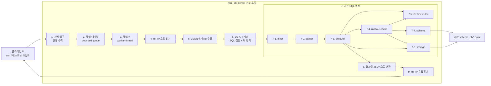
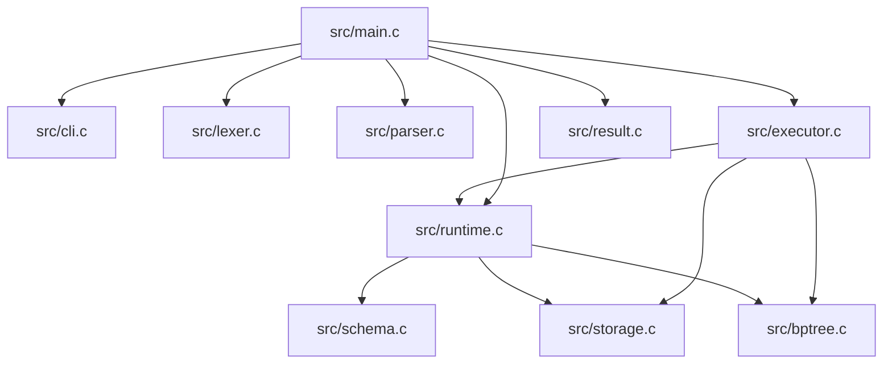
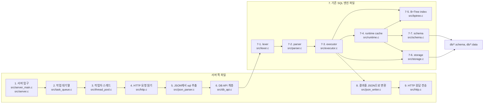
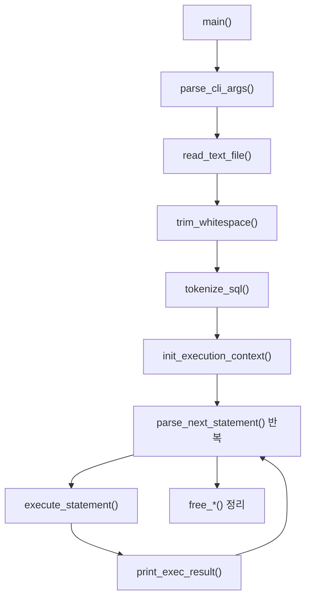
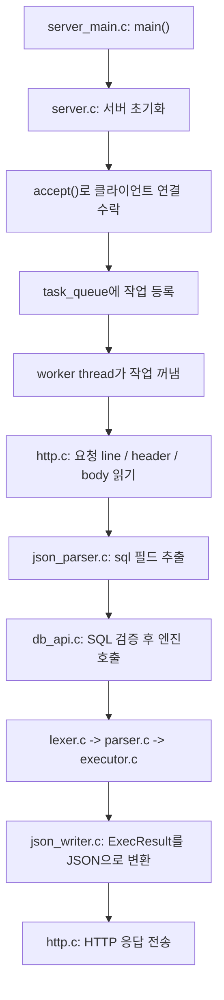
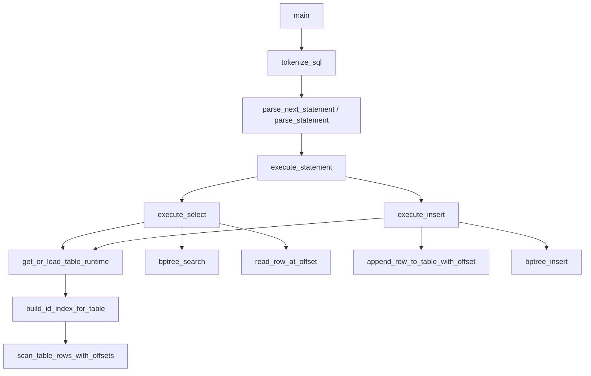
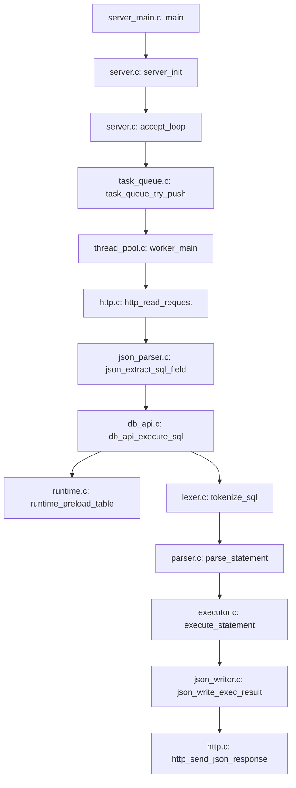

# 미니 DBMS API 서버 전체 흐름 이해 가이드

## 1. 이 문서는 왜 보나

이 문서는 팀원이 "우리가 지금 무엇을 만들고 있는지", "기존 코드가 어디까지 이미 되어 있는지", "앞으로 추가할 서버 파일이 기존 엔진과 어떻게 연결되는지"를 빠르게 이해하기 위한 설명서다.

구현 지시만 필요한 경우에는 `docs/Codex_구현_명세.md`만 보면 된다. 이 문서는 이해를 돕기 위한 문서라서, 설명과 그림을 더 많이 담는다.

## 2. 먼저 이것만 기억하면 된다

1. 지금 레포에는 이미 SQL을 읽고 실행하는 작은 DB 엔진이 있다.
2. 이번 과제는 그 엔진을 버리지 않고, 앞에 HTTP/JSON 서버를 얹는 작업이다.
3. 서버는 요청을 Thread Pool로 병렬 처리한다.
4. 대신 DB 상태가 꼬이지 않게 `SELECT`와 `INSERT`에 락 정책을 둔다.
5. 우리가 새로 만드는 것은 "새 DB 엔진"이 아니라 "기존 엔진을 감싸는 얇은 서버 레이어"다.

## 3. 지금 이미 있는 것과 앞으로 추가할 것

### 3-1. 지금 이미 있는 것

현재 레포는 CLI 기반 SQL 실행기다.

1. `src/main.c`: SQL 파일을 읽고 전체 실행 흐름을 시작한다.
2. `src/lexer.c`: SQL 문자열을 토큰으로 자른다.
3. `src/parser.c`: 토큰을 AST로 바꾼다.
4. `src/executor.c`: AST를 실제 SELECT 또는 INSERT로 실행한다.
5. `src/runtime.c`: 테이블 schema, `next_id`, B+Tree index를 메모리에 캐시한다.
6. `src/storage.c`: `.data` 파일을 읽고 쓴다.
7. `src/schema.c`: `.schema` 파일을 읽는다.
8. `src/bptree.c`: `id -> row_offset` 인덱스를 관리한다.
9. `src/result.c`: 실행 결과를 출력 형식으로 바꾼다.

### 3-2. 앞으로 추가할 것

서버를 붙이기 위해 아래 계층을 추가할 예정이다.

1. `src/server_main.c`: 서버 프로그램 진입점
2. `src/server.c`: 소켓 열기, accept, 종료 처리
3. `src/http.c`: 최소 HTTP 요청 파싱, 응답 전송
4. `src/thread_pool.c`: worker thread 관리
5. `src/task_queue.c`: bounded queue 관리
6. `src/db_api.c`: HTTP 요청에서 받은 SQL을 기존 엔진에 연결
7. `src/json_parser.c`: JSON body에서 `sql` 문자열만 추출
8. `src/json_writer.c`: `ExecResult`를 JSON 응답으로 변환

핵심은 새 서버 파일들이 직접 DB 파일을 만지는 것이 아니라, 최종적으로는 기존 엔진의 `lexer -> parser -> executor -> runtime/storage` 흐름을 재사용한다는 점이다.

## 4. 한눈에 보는 전체 구조

먼저 이 그림은 "실행 흐름"만 보여주는 그림이다. 아직 파일 이름보다, 요청이 서버 안에서 어떤 단계를 거쳐 처리되는지만 보는 게 목적이다.

이 그림을 아주 짧게 풀면 아래와 같다.

1. 클라이언트 요청은 먼저 서버 입구에 들어온다.
2. 요청은 바로 실행되지 않고 queue에 들어간다.
3. worker thread 하나가 queue에서 요청을 꺼낸다.
4. HTTP body에서 SQL 문자열을 꺼낸다.
5. `db_api`가 락 정책을 적용한 뒤 기존 SQL 엔진을 호출한다.
6. 기존 엔진은 필요하면 schema/data 파일을 읽고, 결과를 만든다.
7. 결과를 JSON으로 바꿔 HTTP 응답으로 돌려준다.

## 5. 파일 연결 구조

### 5-1. 현재 엔진 파일 연결

### 5-2. 최종 MVP에서의 파일 연결

위 4번 그림이 "실행 단계"였다면, 아래 그림은 "그 실행 단계를 어떤 파일이 맡는가"를 보여준다.

즉 4번과 5-2번은 다른 내용이 아니라 같은 흐름을 두 번 보는 것이다.

1. 4번: 요청이 어떤 순서로 흘러가는가
2. 5-2번: 그 각 단계를 어떤 파일이 구현하는가

아래 그림에서는 4번과 같은 번호를 그대로 써서 연결되게 했다.

중요한 읽는 법이 하나 있다. 이 화살표는 "호출 방향"만 뜻한다. 즉 `A --> B`는 "A가 B를 사용하거나 호출한다"는 뜻이지, 데이터가 반드시 한 방향으로만 흐른다는 뜻은 아니다. 그래서 `bptree.c`처럼 보조 라이브러리 역할인 파일은 화살표가 들어오기만 하고, 밖으로 나가는 화살표가 없을 수 있다.

4번과 5-2번을 1:1로 연결해서 읽으면 아래처럼 보면 된다.

1. 4번의 `1. 서버 입구` = 5-2의 `src/server_main.c`, `src/server.c`
2. 4번의 `2. 작업 대기열` = 5-2의 `src/task_queue.c`
3. 4번의 `3. 작업자` = 5-2의 `src/thread_pool.c`
4. 4번의 `4. HTTP 요청 읽기` = 5-2의 `src/http.c`
5. 4번의 `5. JSON에서 sql 추출` = 5-2의 `src/json_parser.c`
6. 4번의 `6. DB API 계층` = 5-2의 `src/db_api.c`
7. 4번의 `7. 기존 SQL 엔진` = 5-2의 `src/lexer.c`, `src/parser.c`, `src/executor.c`, `src/runtime.c`, `src/storage.c`, `src/schema.c`, `src/bptree.c`
8. 4번의 `8. 결과를 JSON으로 변환` = 5-2의 `src/json_writer.c`
9. 4번의 `9. HTTP 응답 전송` = 5-2의 `src/http.c`

특히 중요한 포인트는 이것이다.

1. `http.c`는 요청을 읽을 때도 쓰이고, 응답을 보낼 때도 다시 쓰인다.
2. `db_api.c`는 서버와 SQL 엔진 사이의 접착제 역할이라서, 여기서 락 정책과 단일 SQL 검증이 들어간다.
3. 진짜 DB 파일을 직접 읽고 쓰는 것은 새 서버 파일이 아니라 기존 엔진의 `runtime.c`, `storage.c`, `schema.c`, `bptree.c` 쪽이다.

## 6. 현재 CLI 프로그램은 어떻게 동작하나

현재 `sql_processor`의 흐름은 아래와 같다.

쉽게 말하면:

1. SQL 파일 전체를 읽는다.
2. 문자열을 토큰으로 자른다.
3. 토큰에서 SQL 한 문장씩 꺼내 AST로 만든다.
4. AST를 실행한다.
5. 결과를 출력한다.
6. 다음 문장이 있으면 계속 반복한다.

즉 지금 엔진은 이미 "SQL 문장을 실행하는 능력"은 갖고 있고, 부족한 것은 "네트워크 요청을 받아서 그 엔진을 호출하는 서버 부분"뿐이다.

## 7. 최종 API 서버는 어떻게 동작하나

최종 `mini_db_server`의 요청 흐름은 아래로 보면 된다.

쉽게 풀면:

1. 메인 스레드는 손님을 받는 역할만 한다.
2. 실제 SQL 실행은 worker thread가 맡는다.
3. worker는 HTTP body에서 SQL 문자열만 꺼낸다.
4. 그 SQL을 기존 엔진에 넣어 실행한다.
5. 나온 결과를 JSON으로 바꿔서 다시 클라이언트에 보낸다.

## 8. 왜 SELECT도 그냥 무잠금으로 두면 안 되나

이 부분이 이번 프로젝트에서 제일 헷갈리기 쉬운 지점이다.

겉으로 보면 `SELECT`는 읽기만 하니까 락이 없어도 될 것 같지만, 현재 코드에서는 그렇지 않다.

이유는 `src/runtime.c`의 `get_or_load_table_runtime()` 때문이다. 이 함수는 테이블이 아직 메모리에 없으면 아래 작업을 한다.

1. `.schema` 파일을 읽어 schema를 메모리에 올린다.
2. `.data` 파일이 없으면 생성한다.
3. B+Tree를 초기화한다.
4. 기존 `.data` 파일을 끝까지 스캔해서 `id -> row_offset` 인덱스를 다시 만든다.
5. `next_id`를 계산한다.
6. `ExecutionContext.tables` 배열에 새 테이블 runtime을 추가한다.

즉 첫 `SELECT`는 단순 조회가 아니라, 내부적으로는 "메모리 캐시를 만드는 작업"까지 같이 한다.

그래서 이번 프로젝트에서는 아래 둘 중 하나를 골라야 한다.

1. `SELECT`도 처음부터 write lock으로 막는다.
2. 먼저 preload로 테이블 runtime을 안전하게 준비한 뒤, 실제 조회는 read lock으로 돌린다.

이번 문서에서는 두 번째를 선택한다. 이유는 다음과 같다.

1. 첫 접근에서 필요한 초기화는 안전하게 처리할 수 있다.
2. 초기화가 끝난 뒤의 일반 `SELECT`는 여러 개가 동시에 돌 수 있다.
3. 발표 때도 "초기화 구간과 조회 구간을 분리했다"는 설명이 가능하다.

## 9. preload + read lock 정책을 아주 쉽게 설명하면

정책은 아래 한 줄로 기억하면 된다.

1. `SELECT`: 먼저 테이블 준비가 되어 있는지 확인하고, 준비가 안 되어 있으면 안전하게 한 번만 로드한다. 그 다음 조회 자체는 read lock으로 실행한다.
2. `INSERT`: 파일 append, index insert, `next_id` 변경이 모두 들어가므로 write lock으로 실행한다.

`pthread_rwlock_t`를 쓰는 이유도 여기서 나온다.

1. read lock은 여러 `SELECT`가 동시에 잡을 수 있다.
2. write lock은 한 번에 하나의 `INSERT`만 잡을 수 있다.
3. write lock이 잡혀 있을 때는 다른 read/write가 모두 기다린다.

즉 "읽기는 같이", "쓰기는 하나씩"이라는 정책이다.

## 10. 메모리와 파일은 실제로 어떻게 연결되나

이 부분을 이해하면 서버 전체가 훨씬 단순해진다.

### 10-1. 디스크에 있는 것

1. `users.schema` 같은 파일에는 컬럼 이름이 있다.
2. `users.data` 같은 파일에는 실제 row가 한 줄씩 저장된다.

### 10-2. 서버 실행 중 메모리에 있는 것

1. `ExecutionContext`는 서버가 들고 있는 큰 컨테이너다.
2. 그 안에는 테이블별 `TableRuntime`이 들어간다.
3. `TableRuntime` 안에는 schema, `next_id`, B+Tree index가 들어간다.

### 10-3. 실제 흐름

1. 서버가 처음 뜰 때는 메모리에 아무 테이블도 없을 수 있다.
2. 어떤 테이블에 처음 접근하면 `get_or_load_table_runtime()`가 파일을 읽어 메모리 캐시를 만든다.
3. 그 다음부터는 같은 테이블 요청이 들어오면 메모리 캐시를 재사용한다.
4. `SELECT WHERE id = ...`는 B+Tree에서 row 위치를 바로 찾을 수 있다.
5. `INSERT`는 `.data` 파일 끝에 row를 추가하고, B+Tree에도 새 id를 넣는다.

즉 메모리 캐시는 "빠르게 찾기 위한 준비물"이고, 진짜 데이터 원본은 여전히 파일이다.

## 11. 중요한 함수 연결

### 11-1. 현재 엔진의 핵심 함수 연결

### 11-2. 최종 서버의 핵심 함수 연결

아래 함수명은 구현 시점의 권장 이름이다. 아직 파일이 없으므로, 함수명은 이 문서 기준으로 맞춰 구현하면 된다.

## 12. 중요 함수 최소 의사코드

여기서는 팀원이 "이 함수가 대충 무슨 일을 하는지"만 잡을 수 있도록 최소 단계만 적는다.

### 12-1. `src/main.c: main`

1. CLI 인자를 읽는다.
2. SQL 파일을 통째로 읽는다.
3. 공백을 정리한다.
4. SQL 전체를 토큰으로 만든다.
5. `ExecutionContext`를 초기화한다.
6. 토큰에서 SQL 한 문장씩 꺼내 AST로 만든다.
7. AST를 실행한다.
8. 결과를 출력한다.
9. 메모리를 정리하고 종료한다.

### 12-2. `src/lexer.c: tokenize_sql`

1. SQL 문자열을 앞에서부터 한 글자씩 본다.
2. 공백은 건너뛴다.
3. 글자면 식별자 토큰으로 만든다.
4. 숫자면 숫자 토큰으로 만든다.
5. 따옴표면 문자열 토큰으로 만든다.
6. `(`, `)`, `,`, `;`, `=` 같은 기호는 심볼 토큰으로 만든다.
7. 마지막에 EOF 토큰을 붙인다.

### 12-3. `src/parser.c: parse_statement`

1. 토큰 시작 위치에서 다음 SQL 문장 하나를 파싱한다.
2. 첫 키워드가 `INSERT`면 INSERT AST를 만든다.
3. 첫 키워드가 `SELECT`면 SELECT AST를 만든다.
4. 끝의 세미콜론은 있으면 소비한다.
5. 뒤에 다른 의미 있는 토큰이 남아 있으면 에러로 처리한다.

### 12-4. `src/runtime.c: get_or_load_table_runtime`

1. 이미 메모리에 올라온 테이블인지 먼저 찾는다.
2. 있으면 기존 runtime을 그대로 반환한다.
3. 없으면 `.schema` 파일을 읽는다.
4. `.data` 파일이 없으면 만든다.
5. `id` 컬럼이 있으면 B+Tree를 초기화한다.
6. 기존 `.data` 파일을 끝까지 스캔해서 인덱스를 다시 만든다.
7. `next_id`를 계산한다.
8. 새 `TableRuntime`을 `ExecutionContext.tables`에 추가한다.
9. 그 runtime 포인터를 반환한다.

### 12-5. `src/executor.c: execute_statement`

1. AST 타입을 확인한다.
2. INSERT면 `execute_insert`로 보낸다.
3. SELECT면 `execute_select`로 보낸다.
4. 결과를 `ExecResult`에 담아 돌려준다.

### 12-6. `src/executor.c: execute_select`

1. 대상 테이블 runtime을 가져온다.
2. 조회할 컬럼과 WHERE 컬럼이 schema에 있는지 확인한다.
3. `WHERE id = 숫자` 형태면 인덱스 사용 가능 여부를 판단한다.
4. 가능하면 B+Tree 경로로 간다.
5. 아니면 full scan 경로로 간다.
6. 최종 row 목록과 column 목록을 `ExecResult`에 담는다.
7. `used_index`와 `row_count`를 기록한다.

### 12-7. `src/executor.c: execute_insert`

1. 대상 테이블 runtime을 가져온다.
2. auto id 테이블인지 확인한다.
3. auto id 테이블이면 새 id를 만든다.
4. INSERT row 데이터를 최종 컬럼 순서로 맞춘다.
5. `.data` 파일 끝에 row를 추가한다.
6. `id` 컬럼이 있으면 B+Tree에도 새 key를 넣는다.
7. `next_id`를 증가시킨다.
8. `affected_rows`, `generated_id`를 결과에 담는다.

### 12-8. `src/server_main.c: main` 예정

1. 서버 CLI 인자를 읽는다.
2. 전역 `ExecutionContext`를 초기화한다.
3. 전역 `pthread_rwlock_t`를 초기화한다.
4. task queue를 만든다.
5. thread pool을 시작한다.
6. listening socket을 연다.
7. accept loop를 돌린다.
8. 종료 시 스레드, 큐, 락, context를 정리한다.

### 12-9. `src/server.c: accept_loop` 예정

1. 클라이언트 연결을 하나 받는다.
2. 요청 처리에 필요한 최소 정보만 task로 만든다.
3. task queue에 넣어 본다.
4. queue가 가득 찼으면 즉시 `503` 응답을 보낸다.
5. 성공하면 worker가 처리하도록 넘기고 다음 연결을 받는다.

### 12-10. `src/thread_pool.c: worker_main` 예정

1. queue에서 task를 하나 꺼낸다.
2. 소켓에서 HTTP 요청을 읽는다.
3. JSON body에서 SQL 문자열을 뽑는다.
4. SQL을 `db_api_execute_sql`로 보낸다.
5. 받은 결과 JSON을 HTTP 응답으로 보낸다.
6. 소켓과 task 자원을 정리한다.
7. 종료 신호가 오기 전까지 반복한다.

### 12-11. `src/db_api.c: db_api_execute_sql` 예정

1. SQL 문자열이 비었는지 확인한다.
2. SQL을 토큰으로 만든다.
3. 정확히 한 문장인지 파싱으로 확인한다.
4. 다중 statement면 거절한다.
5. SELECT면 필요한 테이블을 먼저 preload한다.
6. SELECT 실행 구간은 read lock으로 감싼다.
7. INSERT 실행 구간은 write lock으로 감싼다.
8. `execute_statement`를 호출한다.
9. `ExecResult`를 JSON 응답 구조로 바꾼다.
10. 상태 코드와 에러 코드를 함께 반환한다.

### 12-12. `src/runtime.c: runtime_preload_table` 예정

1. AST에서 어떤 테이블을 쓰는지 찾는다.
2. 해당 테이블 runtime이 이미 있는지 확인한다.
3. 없으면 안전한 구간에서 `get_or_load_table_runtime`를 호출한다.
4. 필요한 schema, index, `next_id` 준비를 끝낸다.
5. 이후 실제 SELECT는 read lock에서 바로 실행할 수 있게 만든다.

## 13. 발표에서 어떻게 보여주면 좋나

이번 과제는 하루짜리 프로젝트라서, "많이 만들었다"보다 "핵심을 정확히 만들었다"가 더 중요하다.

발표 포인트는 아래 순서가 좋다.

### 13-1. 문제 정의

1. 기존 SQL 엔진은 CLI로만 동작했다.
2. 우리는 이 엔진을 HTTP API 서버로 감쌌다.
3. 단순 직렬 서버가 아니라 thread pool로 병렬 처리했다.
4. 동시에 데이터 정합성을 위해 락 정책을 설계했다.

### 13-2. 데모 흐름

1. `GET /health`로 서버가 살아 있음을 보여준다.
2. `POST /query`로 INSERT 여러 개를 보낸다.
3. `POST /query`로 SELECT 여러 개를 동시에 보낸다.
4. 응답 JSON에서 `used_index`, `generated_id`를 보여준다.

### 13-3. 병렬 처리 보여주기

1. 같은 시점에 여러 요청을 보내는 간단한 스크립트를 준비한다.
2. 요청 로그에 시작 시각과 종료 시각을 남긴다.
3. 서로 다른 worker가 동시에 요청을 처리한 흔적을 보여준다.
4. 직렬 처리였다면 오래 걸릴 케이스가 더 빨리 끝나는 걸 보여준다.

### 13-4. 동시성 제어 보여주기

1. INSERT를 여러 개 동시에 보냈을 때 id가 중복되지 않는 결과를 보여준다.
2. SELECT와 INSERT를 섞어서 보내도 데이터가 깨지지 않는 걸 보여준다.
3. 왜 `SELECT preload + read lock`, `INSERT write lock`을 골랐는지 설명한다.

### 13-5. 숫자 튜닝 보여주기

1. 처음에는 `worker 4`, `queue 64`로 시작했다고 말한다.
2. 그 숫자는 감이 아니라 시작점이라고 설명한다.
3. 벤치마크 후 더 나은 숫자가 나오면 바꿀 수 있게 옵션화했다고 말한다.

## 14. 이 문서를 본 뒤 어디를 보면 되나

1. 구현을 바로 맡을 사람은 `docs/Codex_구현_명세.md`를 본다.
2. 현재 엔진 코드를 읽고 싶으면 `src/main.c`, `src/executor.c`, `src/runtime.c`, `src/storage.c` 순서로 본다.
3. 서버 설계를 이해하고 싶으면 이 문서의 7장, 9장, 11장, 12장을 다시 보면 된다.
