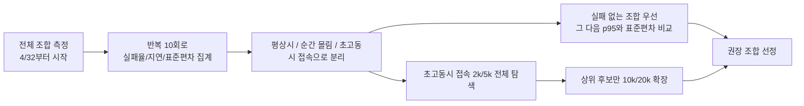
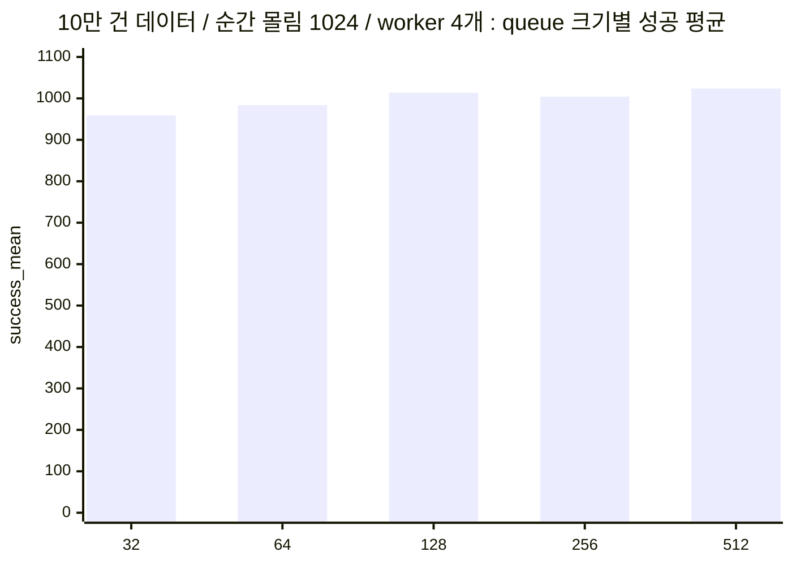
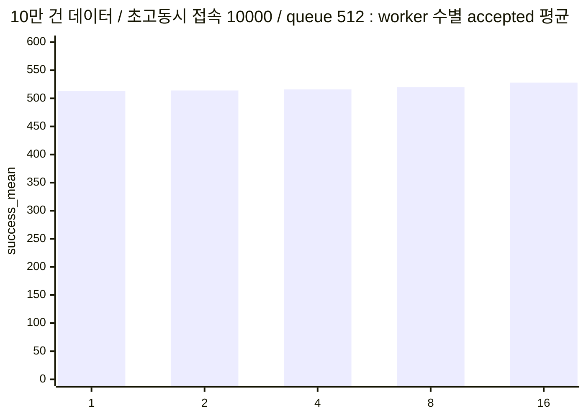

# mini_db_server 통합 성능 리포트

## 처음 보는 분을 위한 안내

- 이 문서는 여러 개별 리포트를 하나로 묶은 종합본입니다. 한 문서에서 `평상시 트래픽`, `짧은 순간의 몰림`, `수천 개 이상 동시 접속`을 함께 볼 수 있습니다.
- `reports/` 최상단에는 꼭 봐야 하는 문서만 두고, 세부 리포트는 `reports/details/`, CSV 원본은 `reports/data/`로 정리했습니다.
- 이 문서가 답하려는 질문은 간단합니다. `어떤 상황에서 worker thread 수와 queue 크기를 어떻게 잡는 것이 가장 무난한가?` 입니다.
- 가장 먼저 볼 곳은 `시나리오별 추천 조합` 표입니다. 여기에는 상황별로 가장 적절하다고 판단한 설정만 추려져 있습니다.
- `워커 수`는 동시에 실제 일을 처리하는 인원 수, `큐 크기`는 잠시 대기시켜 둘 수 있는 줄 길이라고 생각하면 됩니다.
- 아주 큰 동시 접속(`20k`)에서는 서버 자체 한계뿐 아니라, 테스트를 돌린 로컬 컴퓨터의 포트 한계도 함께 나타날 수 있습니다.

## 용어부터 쉽게 설명

- `10k / 100k / 1M`:
  - 데이터베이스 안에 저장된 사용자 데이터가 각각 `1만 건 / 10만 건 / 100만 건`이라는 뜻입니다.
- `동시성 128`, `동시성 1024`:
  - 같은 순간에 서버로 들어오는 요청 수입니다. 쉽게 말해 동시에 몰려드는 사람 수라고 보면 됩니다.
- `steady-state`:
  - 평상시처럼 요청이 꾸준히 계속 들어오는 상황입니다. 갑자기 폭주하는 상황이 아니라, 평소 운영에 가까운 시나리오입니다.
- `burst`:
  - 짧은 순간에 요청이 확 몰리는 상황입니다. 예를 들어 오픈 직후, 공지 직후, 버튼을 많은 사용자가 동시에 누르는 상황과 비슷합니다.
- `async`:
  - 테스트 도구가 수천 개의 요청을 거의 동시에 보내는 방식입니다. 서버 내부 구현 방식이 `async`라는 뜻이 아니라, `시험을 세게 하기 위한 부하 생성 방식`을 말합니다.
- `성공`:
  - 요청이 정상 처리된 횟수입니다. 높을수록 좋습니다.
- `503`:
  - 서버가 너무 바빠서 이번 요청은 받지 못하겠다고 돌려준 횟수입니다. 큐가 꽉 찼을 때 주로 발생합니다.
- `오류`:
  - 정상 응답(JSON) 자체를 받지 못한 횟수입니다. 서버 문제일 수도 있고, 테스트를 돌린 컴퓨터나 OS 한계가 섞일 수도 있습니다.
- `accepted` 또는 `accepted request count`:
  - 테스트 도구가 보낸 전체 요청 중에서, 서버가 실제로 받아들여 처리 단계로 넘긴 요청 수를 뜻합니다.
  - 특히 초고동시 접속 실험에서는 `전체 요청 수`와 `실제로 받아들인 요청 수(accepted)`를 구분해서 봐야 서버가 어디까지 감당했는지 이해할 수 있습니다.
- `평균 ms`:
  - 전체 요청을 평균적으로 얼마나 빨리 처리했는지 보여줍니다.
- `p95 ms`:
  - 느린 요청들까지 포함해서 봤을 때의 체감 품질입니다. 평균보다 더 중요하게 보는 값입니다.
- `tail latency`:
  - 응답 시간 분포에서 `느린 쪽 끝부분 지연시간`을 말합니다.
  - 이 보고서에서는 주로 `p95 ms`가 tail latency를 대표하는 값입니다.
- `표준편차`:
  - 같은 실험을 여러 번 했을 때 결과가 얼마나 흔들렸는지 나타냅니다. 작을수록 더 안정적입니다.
- `raw sample`:
  - 여러 번 반복한 실험을 평균내기 전의 `개별 실행 기록`입니다.
  - 예를 들어 어떤 조합을 10번 돌렸다면, 그 10번 각각의 결과가 raw sample이고, 그걸 묶어 만든 요약값이 summary입니다.

## 이 보고서를 읽는 순서

1. `시나리오별 추천 조합` 표에서 상황별 추천값을 먼저 봅니다.
2. 그 아래 `핵심 결론`과 `인사이트`에서 왜 그런 추천이 나왔는지 읽습니다.
3. 더 자세한 수치가 필요하면 맨 아래 `전체 결과 상세표`를 봅니다.

## 시나리오가 실제로 의미하는 상황

- `평상시 트래픽 (steady-state, 동시 128)`:
  - 서버가 평소처럼 계속 요청을 받는 상황입니다.
- `짧은 순간 몰림 (burst 512 / 1024)`:
  - 짧은 순간에 512명 또는 1024명이 거의 동시에 들어오는 상황입니다.
- `초고동시 접속 (async 2000 / 5000 / 10000 / 20000)`:
  - 테스트 도구가 2000명, 5000명, 10000명처럼 매우 큰 규모로 거의 동시에 요청을 보내는 상황입니다.

## burst와 async의 차이

- 이름이 비슷해서 헷갈리기 쉽지만, 이 둘은 보는 목적이 다릅니다.
- `burst`:
  - 현실적인 순간 몰림 시험입니다.
  - 예를 들면 이벤트 직후나 공지 직후처럼, 짧은 순간에 사용자가 몰려드는 상황을 흉내 냅니다.
  - 이 보고서에서는 보통 `512`, `1024` 요청 수준에서 봤습니다.
- `async`:
  - 극단적인 고동시성 시험입니다.
  - 여기서 `async`는 서버 구현 방식이 아니라, 테스트 도구가 수천 개 요청을 거의 동시에 쏘는 방법을 뜻합니다.
  - 이 보고서에서는 `2000`, `5000`, `10000`, `20000` 수준까지 올려서 봤습니다.
- 쉽게 비유하면:
  - `burst`는 `갑자기 손님이 많이 몰린다`에 가깝습니다.
  - `async`는 `테스트 도구가 일부러 수천 명이 한꺼번에 몰린 것처럼 만든다`에 가깝습니다.
- 그래서 해석도 다르게 해야 합니다.
  - `burst`는 `순간 몰림을 얼마나 부드럽게 넘기느냐`를 봅니다.
  - `async`는 `서버가 어디서부터 못 버티고 거절하기 시작하느냐`를 봅니다.
- 이번 결과도 그렇게 읽었습니다.
  - `burst`에서는 `worker=1/2`가 오히려 강한 구간이 있었습니다.
  - 하지만 `async`에서는 `worker=1/2`가 받아낼 수 있는 요청 수가 너무 작아서 운영 기본값으로는 불리했습니다.

## 워커 수와 큐 크기 결정 방법

- 이 문서의 결론을 한 문장으로 줄이면 `가장 빠른 조합`을 찾는 게 아니라 `가장 덜 문제를 만드는 조합`을 찾는 것입니다.
- 먼저 역할부터 나눠 보면:
  - `worker 수`는 동시에 실제 일을 처리하는 인원 수입니다.
  - `queue 크기`는 한꺼번에 몰린 요청을 잠시 기다리게 둘 수 있는 줄 길이입니다.
- 그래서 두 값을 정할 때는 아래 순서로 보는 것이 가장 덜 헷갈립니다.

1. 먼저 `우리가 대비하려는 상황`을 정합니다.
   - 평상시 운영이 중요한지
   - 순간 몰림이 중요한지
   - 수천 개 이상 고동시 접속까지 버텨야 하는지
   - 이걸 먼저 정하지 않으면, 모든 표가 다 맞는 말처럼 보여서 오히려 더 헷갈립니다.

2. 그 상황에서 `실패 없는 가장 작은 조합`을 먼저 찾습니다.
   - 여기서 실패는 `503`이나 `오류`가 나는 경우를 뜻합니다.
   - 예를 들어 더 큰 조합이 조금 더 빠르더라도, 이미 작은 조합이 실패 없이 버틴다면 그 작은 조합이 더 좋은 출발점입니다.

3. 실패 없는 조합들끼리 `p95`를 봅니다.
   - 평균 속도보다 `가끔 너무 느린 순간`을 줄이는 것이 실제 체감에 더 중요하기 때문입니다.
   - 평균은 좋아 보여도 p95가 높으면 운영 중 불만이 생기기 쉽습니다.

4. 그다음 `표준편차`를 봅니다.
   - 같은 테스트를 10번 돌렸을 때 값이 덜 흔들리는 조합이 더 믿을 만합니다.
   - 한 번은 빠르고 한 번은 느린 조합보다, 조금 덜 빨라도 매번 비슷한 조합이 운영에는 더 유리합니다.

5. 차이가 작으면 `더 작은 자원 조합`을 고릅니다.
   - 성능 차이가 거의 없는데 워커와 큐를 크게 늘릴 이유는 많지 않습니다.
   - 자원을 크게 잡으면 메모리, context switch, lock contention 같은 다른 비용이 붙을 수 있습니다.

- 이 기준을 이번 결과에 그대로 대입하면 이렇게 읽을 수 있습니다.
  - `평상시 트래픽`:
    - `10k/100k`는 `4/128`
    - `1M`은 `8/128`
    - 이유는 이 구간에서 `worker=1/2`가 버티더라도 p95가 더 높았기 때문입니다.
  - `짧은 순간 몰림 (burst 1024)`:
    - `10k`는 `2/256`
    - `100k`는 `1/128`
    - `1M`은 `2/32`
    - 이유는 이 시나리오에서는 낮은 워커 수가 오히려 p95와 표준편차에서 더 좋았기 때문입니다.
  - `초고동시 접속 (async)`:
    - `8/512` 또는 `16/512`
    - 이유는 이 구간에서는 `worker=1/2`가 받아낼 수 있는 요청 수 자체가 너무 작았기 때문입니다.

- 결국 중요한 건 `정답 하나`를 찾는 게 아니라, `우리 서비스에서 제일 중요한 상황`에 맞는 기본값을 정하는 것입니다.
- 실무적으로 아주 단순하게 정리하면:
  - `평상시 운영 기본값`이 필요하면 `4/128`
  - `큰 데이터셋 평상시 운영`까지 고려하면 `8/128`
  - `버스트와 고동시성까지 하나로 묶은 보수적 기본값`이 필요하면 `8/512`
- 그리고 보고서를 읽을 때는 이렇게 생각하면 됩니다.
  - `burst 표`는 `짧은 순간 몰림 대응용`
  - `async 표`는 `극한 수용 한계 확인용`
  - `steady-state 표`는 `평소 운영용`

## 범위

- 목적: 먼저 `workers=4`, `queue=32`부터 시작해 조합을 넓게 탐색하고, 그 뒤 `worker=1 / 2` 보강 실험을 추가해 낮은 워커 수가 실제로도 쓸 만한지 확인한다.
- 평상시 트래픽 실험(`steady-state`): `동시성 128`, `mixed`, 데이터셋 `10k / 100k / 1M`, 조합당 `10회` 반복
- 짧은 순간 몰림 실험(`burst`): `동시성 512 / 1024`, `mixed`, 데이터셋 `10k / 100k / 1M`, 조합당 `10회` 반복
- 초고동시 접속 실험 1차(`async`): `동시성 2000 / 5000`, 데이터셋 `100k`, 워커 `4 / 8 / 16`, 큐 `32 / 64 / 128 / 256 / 512`, 조합당 `10회` 반복
- 초고동시 접속 실험 2차(`async`): `동시성 10000 / 20000`, 데이터셋 `100k / 1M`, 큐 `512`, 워커 `4 / 8 / 16`, 조합당 `10회` 반복
- 추가 보강 실험(`worker=1 / 2`):
  - 평상시 트래픽: `동시성 128`, `mixed`, 데이터셋 `10k / 100k / 1M`, 큐 `32 / 64 / 128 / 256 / 512`, 조합당 `10회` 반복
  - 평상시 트래픽의 총 요청 수는 현재 하네스 기본값인 `10k=3000`, `100k=2000`, `1M=1000`을 사용했습니다. 그래서 이 구간은 기존 표와 `절대 숫자`를 1:1로 비교하기보다, `어느 시점부터 실패 없이 안정화되는지`를 보는 보강 검증으로 해석했습니다.
  - 짧은 순간 몰림: `동시성 512 / 1024`, `mixed`, 데이터셋 `10k / 100k / 1M`, 큐 `32 / 64 / 128 / 256 / 512`, 조합당 `10회` 반복
  - 초고동시 접속: `동시성 2000 / 5000 / 10000 / 20000`, 데이터셋 `100k / 1M`, 큐 `512`, 조합당 `10회` 반복
- 반복 측정 수: 초기 탐색 `177`개 조합 + 저워커 보강 `106`개 조합 = 요약표 기준 `283`개 조합, 개별 실행 기록 기준 `2830`회 실험
- 통합 요약 CSV: `/Users/hi/Library/CloudStorage/Dropbox/Mac/Desktop/Jungle/Threaded_DB-API_Server/reports/data/api_server_benchmark_results_matrix_all.csv`, `/Users/hi/Library/CloudStorage/Dropbox/Mac/Desktop/Jungle/Threaded_DB-API_Server/reports/data/api_server_stress_results_matrix_all.csv`, `/Users/hi/Library/CloudStorage/Dropbox/Mac/Desktop/Jungle/Threaded_DB-API_Server/reports/data/api_server_async_stress_results_matrix_all.csv`
- 통합 개별 실행 CSV(`raw sample`): `/Users/hi/Library/CloudStorage/Dropbox/Mac/Desktop/Jungle/Threaded_DB-API_Server/reports/data/api_server_benchmark_samples_matrix_all.csv`, `/Users/hi/Library/CloudStorage/Dropbox/Mac/Desktop/Jungle/Threaded_DB-API_Server/reports/data/api_server_stress_samples_matrix_all.csv`, `/Users/hi/Library/CloudStorage/Dropbox/Mac/Desktop/Jungle/Threaded_DB-API_Server/reports/data/api_server_async_stress_samples_matrix_all.csv`
- 저워커 보강 요약 CSV: `/Users/hi/Library/CloudStorage/Dropbox/Mac/Desktop/Jungle/Threaded_DB-API_Server/reports/data/api_server_benchmark_results_workers_1_2.csv`, `/Users/hi/Library/CloudStorage/Dropbox/Mac/Desktop/Jungle/Threaded_DB-API_Server/reports/data/api_server_stress_results_workers_1_2.csv`, `/Users/hi/Library/CloudStorage/Dropbox/Mac/Desktop/Jungle/Threaded_DB-API_Server/reports/data/api_server_async_stress_results_workers_1_2_q512.csv`

## 정합성 검증

- 동시 SELECT 정합성: `통과`
- 동시 INSERT 고유성: `통과`
- 256개 동시 INSERT 이후 최종 row count: `통과`
- bounded queue `503` 경로 검증: `통과`

## 핵심 결론

- 상황마다 좋은 값이 달랐기 때문에, `모든 경우에 통하는 단일 기본값` 하나를 고르는 방식은 적절하지 않았습니다.
- 평상시 트래픽(`steady-state`)에서는 `10k/100k`가 모두 `4/128`에서 처음 안정권에 들어왔고, `1M`에서는 `8/128`이 가장 안정적이었습니다.
- `worker=1 / 2` 보강 실험을 추가해 보니, 평상시 트래픽에서는 낮은 워커 수가 기존 추천을 뒤집지 못했습니다. `10k/100k`는 대체로 `queue=128`부터 안정화됐지만 p95가 여전히 높았고, `1M`에서만 `2/128`이 기존 `8/128`에 가까운 수준까지 따라왔습니다.
- 짧은 순간 몰림(`burst 1024`)에서는 예상보다 낮은 워커 수가 강한 구간도 있었습니다. 보강 실험까지 합치면 `10k`에서는 `2/256`, `100k`에서는 `1/128`, `1M`에서는 `2/32`가 가장 좋은 조합이었습니다.
- 초고동시 접속(`async 2k/5k/10k`)에서는 실제로 받아들일 수 있는 요청 수가 거의 `worker 수 + queue 크기` 상한으로 모였습니다. `16/512`가 최대로 받지만, `8/512`와 차이는 매우 작았습니다.
- 반대로 초고동시 접속에서 `worker=1 / 2`는 `queue=512`를 써도 accepted가 거의 `513 / 514`에 고정됐습니다. 즉 저워커 조합은 `burst`에는 일부 강점이 있었지만, `수천~수만 동시 접속` 운영 기본값으로는 적합하지 않았습니다.
- 초고동시 접속 `20k`에서는 서버 포화(`503`)와 단일 머신의 로컬 포트 한계(`oserror_49`)가 동시에 나타났습니다. 즉 이 구간은 서버 한계만 보는 시험이 아니었습니다.
- 같은 실험을 10번 반복해 보니, 한 번만 돌렸을 때는 멀쩡해 보이는 조합도 느린 쪽 끝부분 지연시간(`tail latency`)이 갑자기 길어지는 경우가 있었습니다. 그래서 이번 추천은 평균 속도만이 아니라 `실패율 + p95 + 표준편차`를 같이 보고 정했습니다.

## 처리 모델 비교 요약

- worker/queue 조합 탐색과 별도로, `직렬 서버`, `스레드풀 서버`, `요청당 스레드 서버`를 같은 HTTP API와 같은 DB/lock 정책으로 직접 비교한 리포트도 만들었습니다.
- 상세 문서: [api_server_model_comparison_report.md](/Users/hi/Library/CloudStorage/Dropbox/Mac/Desktop/Jungle/Threaded_DB-API_Server/reports/details/api_server_model_comparison_report.md)
- 기본 비교(`100k`, 동시성 `1~128`)에서는 세 모델의 순수 처리량 차이가 생각보다 크지 않았고, 병렬이 항상 직렬보다 빠르지는 않았습니다.
- `INSERT` 중심 workload에서는 write lock 영향이 커서 직렬이 자주 가장 빠르거나 가장 경제적이었습니다.
- `mixed 128`, `burst 1024`처럼 읽기와 쓰기가 섞이거나 순간 부하가 커지면 스레드풀이 `p95`와 처리량 균형에서 더 나은 결과를 보였습니다.
- `async 2000/5000` 과부하에서는 직렬이 요청을 모두 받아주지만 `p95`가 `2.7~2.9초`까지 늘었고, 스레드풀/요청당 스레드 방식은 약 `520`건 수준만 처리하고 나머지를 `503`으로 빠르게 거절해 지연을 `0.2~0.6초`대로 억제했습니다.
- 요청당 스레드 방식은 `async 2000`에서 가장 높은 성공 처리량을 보인 구간도 있었지만, 같은 구간에서 스레드풀보다 메모리와 context switch 비용이 크게 높았습니다.
- 정리하면 이번 구현에서 스레드풀의 가장 큰 장점은 `항상 가장 빠름`보다는 `burst/overload에서 tail latency를 통제하면서, 요청당 스레드보다 더 안정적인 비용 구조를 유지한다`는 점이었습니다.

## 시나리오별 추천 조합

| 시나리오 | 데이터셋 행 수 | 권장 조합 | 핵심 수치 | 자원 절충안 | 해석 |
| --- | --- | --- | --- | --- | --- |
| 평상시 트래픽 (steady-state, 동시 128) | 10000 | `4/128` | p95=`16.372`, 표준편차=`3.733` | `4/128` | 작은 데이터셋에서는 `4/128`이 처음으로 안정권에 들어왔고, 그 이후 큐를 더 키워도 체감 이득이 크지 않았습니다. |
| 평상시 트래픽 (steady-state, 동시 128) | 100000 | `4/128` | p95=`18.732`, 표준편차=`5.966` | `4/128` | 10만 건 데이터에서도 `4/128`이 처음으로 실패 없이 버틴 조합이었습니다. 그보다 큰 조합은 평균은 비슷해도 결과 흔들림이 커졌습니다. |
| 평상시 트래픽 (steady-state, 동시 128) | 1000000 | `8/128` | p95=`15.231`, 표준편차=`0.810` | `2/128` | 100만 건 데이터에서는 `8/128`이 가장 안정적이었습니다. 다만 보강 실험에서는 `2/128`도 꽤 근접한 결과를 보여, 자원을 아주 보수적으로 써야 하는 경우의 후보가 됐습니다. |
| 짧은 순간 몰림 (burst 512) | 10000 | `16/256` | p95=`3.078`, 표준편차=`0.180` | `4/64` | 1만 건 데이터에서 순간적으로 512개 요청이 몰릴 때는 `16/256`이 가장 안정적이었습니다. 다만 `4/64`도 충분히 실용적인 절충안이었습니다. |
| 짧은 순간 몰림 (burst 1024) | 10000 | `2/256` | p95=`3.890`, 표준편차=`0.980` | `1/512` | `worker=1/2` 보강 실험을 포함해 다시 보면, 1만 건 데이터의 1024 버스트에서는 오히려 낮은 워커 수가 더 좋았습니다. `2/256`이 가장 안정적이었고, `1/512`도 거의 비슷한 품질을 보였습니다. |
| 짧은 순간 몰림 (burst 512) | 100000 | `8/64` | p95=`3.718`, 표준편차=`0.341` | `8/32` | 10만 건 데이터에서 순간적으로 512개 요청이 몰릴 때는 `8/64`가 가장 빠르고 안정적이었습니다. `8/32`도 거의 비슷한 절충안입니다. |
| 짧은 순간 몰림 (burst 1024) | 100000 | `1/128` | p95=`7.306`, 표준편차=`7.022` | `4/512` | 10만 건 데이터의 1024 버스트에서는 `1/128`이 가장 가볍고도 가장 나은 결과를 냈습니다. 다만 더 보수적으로 headroom을 두고 싶다면 기존 추천이었던 `4/512`도 여전히 안전한 선택입니다. |
| 짧은 순간 몰림 (burst 512) | 1000000 | `16/32` | p95=`3.215`, 표준편차=`0.105` | `4/32` | 100만 건 데이터에서 순간적으로 512개 요청이 몰릴 때는 여러 조합이 괜찮았지만, `16/32`가 가장 안정적이었습니다. 비용을 줄이면 `4/32`도 충분히 쓸 수 있습니다. |
| 짧은 순간 몰림 (burst 1024) | 1000000 | `2/32` | p95=`4.166`, 표준편차=`0.860` | `8/512` | 100만 건 데이터의 1024 버스트에서는 `2/32`가 가장 안정적이었습니다. 최대한 가볍게 운영해도 되는 케이스가 확인됐고, 여러 상황을 하나로 묶어 가져가려면 여전히 `8/512`가 무난한 절충안입니다. |
| 초고동시 접속 (async 2000) | 100000 | `16/512` | accepted 평균=`528.0`, 오류 평균=`0.0` | `8/512` | 2000개 요청을 거의 동시에 보낼 때는 서버가 실제로 받아들인 요청 수(`accepted`)가 거의 `worker 수 + queue 크기`로 결정됐습니다. `16/512`가 최댓값이지만 `8/512`와 차이는 작았습니다. |
| 초고동시 접속 (async 5000) | 100000 | `16/512` | accepted 평균=`528.0`, 오류 평균=`0.0` | `8/512` | 5000개 요청을 거의 동시에 보낼 때도 같은 패턴이 반복됐습니다. 워커를 늘리는 것보다 큐를 충분히 확보하는 쪽이 더 중요했습니다. |
| 초고동시 접속 (async 10000) | 100000 | `16/512` | accepted 평균=`528.0`, 오류 평균=`0.0` | `8/512` | 10000개 요청을 거의 동시에 보낼 때도 `16/512`가 가장 많이 받아들였고, `8/512`는 거의 비슷한 결과에 자원을 덜 사용했습니다. |
| 초고동시 접속 (async 20000) | 100000 | `16/512` | accepted 평균=`528.0`, 오류 평균=`3650.3` | `8/512` | 20000개 요청을 거의 동시에 보낼 때는 서버가 바빠서 거절한 요청 외에, 테스트를 돌린 컴퓨터 자체가 버티지 못한 오류도 섞였습니다. |
| 초고동시 접속 (async 10000) | 1000000 | `16/512` | accepted 평균=`528.0`, 오류 평균=`0.0` | `8/512` | 100만 건 데이터에서도 서버가 실제로 받아들인 요청 수(`accepted`)는 거의 비슷했고, `8/512`가 자원 대비 효율이 좋았습니다. |
| 초고동시 접속 (async 20000) | 1000000 | `16/512` | accepted 평균=`528.0`, 오류 평균=`3644.8` | `8/512` | 100만 건 데이터에서 20000개 요청을 거의 동시에 보내면, 서버 한계와 테스트 머신 한계가 함께 드러났습니다. `8/512`는 실무적인 절충안이었습니다. |

## worker 1/2 추가 실험 요약

- 이 섹션은 사용자의 요청에 따라 `worker=1`과 `worker=2`를 따로 보강 측정한 결과만 모아 해석한 부분입니다.
- 요점은 단순합니다. `평상시 트래픽`에서는 기존 추천을 뒤집지 못했고, `버스트`에서는 의외로 강한 구간이 있었고, `초고동시 접속`에서는 수용량 상한이 너무 낮았습니다.

| 구간 | 대표 조건 | worker=1 / 2에서 가장 좋았던 조합 | 해석 |
| --- | --- | --- | --- |
| 평상시 트래픽 | `10k`, 동시 `128` | `1/256`, p95=`30.558` | `queue=128`부터는 실패 없이 버텼지만, 기존 `4/128`보다 느렸습니다. 작은 워커 수는 평소 운영 기본값으로는 불리했습니다. |
| 평상시 트래픽 | `100k`, 동시 `128` | `2/128`, p95=`31.323` | `10만 건`도 비슷했습니다. `queue=128` 아래에서는 실패가 남았고, 안정화 후에도 지연시간이 높았습니다. |
| 평상시 트래픽 | `1M`, 동시 `128` | `2/128`, p95=`15.964` | 대용량에서는 `2/128`이 꽤 선전했습니다. 최고는 아니지만, 아주 보수적인 자원 운영 후보로 볼 수는 있었습니다. |
| 순간 몰림 | `10k`, 버스트 `1024` | `2/256`, p95=`3.890` | 기존 추천보다 더 좋았습니다. 작은 데이터셋의 짧은 버스트에서는 낮은 워커 수가 오히려 유리할 수 있었습니다. |
| 순간 몰림 | `100k`, 버스트 `1024` | `1/128`, p95=`7.306` | `4/512`보다 더 가볍고 더 나은 결과가 나왔습니다. 이 구간은 이번 보강 실험으로 결론이 실제로 바뀐 대표 사례였습니다. |
| 순간 몰림 | `1M`, 버스트 `1024` | `2/32`, p95=`4.166` | `8/512`보다 더 가볍고 더 안정적이었습니다. 큰 데이터셋에서도 특정 버스트 조건에서는 낮은 워커 수가 충분히 경쟁력 있었습니다. |
| 초고동시 접속 | `100k`, 동시 `10000`, `queue=512` | `1/512`는 accepted=`513`, `2/512`는 accepted=`514` | 초고동시 접속에서는 워커를 1이나 2로 두면 수용량이 사실상 `513~514` 수준에 고정됐습니다. 빠르게 거절하는 성격은 유지되지만, 받아낼 수 있는 양 자체가 너무 적었습니다. |
| 초고동시 접속 | `1M`, 동시 `10000`, `queue=512` | `1/512`는 accepted=`513`, `2/512`는 accepted=`514` | 데이터셋이 커져도 패턴은 거의 같았습니다. 이 구간에서는 작은 워커 수보다 충분한 큐와 더 많은 워커 확보가 중요했습니다. |

## 인사이트

- 작은 큐(`32`, `64`)는 한 번만 돌리면 괜찮아 보여도, 10번 반복하면 가끔씩 오류가 나거나 일부 요청이 유독 오래 걸리는 경우가 자주 나타났습니다.
- 평상시 트래픽에서는 `worker=1 / 2` 보강 실험을 넣어도 큰 그림은 바뀌지 않았습니다. `10k/100k`는 여전히 `4/128`이 가장 설득력 있었고, `1M`에서만 `2/128`이 절충안으로 떠올랐습니다.
- 반면 `burst 1024`는 결론이 실제로 바뀌었습니다. `10k`에서는 `2/256`, `100k`에서는 `1/128`, `1M`에서는 `2/32`가 가장 좋았습니다. 즉 `순간 몰림`에서는 워커를 크게 잡는 것이 항상 정답이 아니었습니다.
- 이번 보강 실험으로 보면 `버스트`와 `초고동시 접속`은 분리해서 생각해야 합니다. 작은 워커 수는 짧은 버스트에서는 강할 수 있지만, 수천 개 이상의 동시 접속에서는 수용량 상한이 너무 낮아졌습니다.
- 초고동시 접속(`async 2k/5k/10k`)에서는 실제로 서버가 받아들일 수 있는 요청 수(`accepted`)가 거의 `worker 수 + queue 크기`로 결정됐습니다. 즉 아주 큰 동시 접속에서는 워커를 조금 더 늘리는 것보다 큐를 충분히 확보하는 편이 더 중요했습니다.
- 초고동시 접속 `20k`에서는 `503`와 `oserror_49`가 같이 보였습니다. 이는 서버가 바빠서 거절한 요청과, 테스트를 돌린 컴퓨터 자체가 감당하지 못한 요청이 동시에 있었다는 뜻입니다.
- 이번 결과만 보면 `100k` 동시 접속이나 `1M` 동시 접속은 단일 로컬 머신으로는 검증하기 어렵습니다. 여러 대의 부하 발생기를 나눠 써야 합니다.

## 그래프

## 결과 해석 메모

- `4/128`은 1만 건과 10만 건 데이터의 평상시 운영 기본값으로 가장 설득력이 높았습니다.
- `8/128`은 100만 건 데이터의 평상시 운영 기본값으로 가장 무난했습니다. 다만 이번 보강 실험으로 `2/128`도 절충안 후보에 넣을 수 있게 됐습니다.
- `8/64`는 10만 건 데이터에서 `burst 512` 상황을 가장 잘 버틴 절충안이었습니다.
- `1/128`은 10만 건 데이터의 `burst 1024`에서 의외로 가장 강했습니다. `짧은 버스트`만 놓고 보면 낮은 워커 수가 더 나은 구간이 실제로 있었습니다.
- `2/32`는 100만 건 데이터의 `burst 1024`에서 가장 인상적인 결과였습니다. 매우 가벼운 설정인데도 p95와 표준편차가 모두 좋았습니다.
- 초고동시 접속 시험에서는 `8/512` 또는 `16/512`가 여전히 더 현실적이었습니다. `worker=1 / 2`는 받아낼 수 있는 요청 수가 `513 / 514`로 너무 낮았습니다.

## 전체 결과 상세표: 평상시 트래픽

| 데이터셋 행 수 | 워커 수 | 큐 크기 | 총 요청 수 | 반복 횟수 | 성공 평균+-표준편차 | 503 평균+-표준편차 | 오류 평균+-표준편차 | 평균 지연시간(ms) 평균+-표준편차 | p95 지연시간(ms) 평균+-표준편차 | 최대 지연시간(ms) 평균+-표준편차 |
| --- | --- | --- | --- | --- | --- | --- | --- | --- | --- | --- |
| 10000 | 4 | 32 | 1000 | 10 | 830.1 +- 11.0 | 1.9 +- 1.4 | 168.0 +- 11.7 | 6.514 +- 0.258 | 14.382 +- 0.592 | 22.901 +- 3.143 |
| 10000 | 4 | 64 | 1000 | 10 | 969.9 +- 63.9 | 0.4 +- 0.7 | 29.7 +- 63.3 | 7.422 +- 1.719 | 16.055 +- 3.092 | 25.279 +- 5.836 |
| 10000 | 4 | 128 | 1000 | 10 | 1000.0 +- 0.0 | 0.0 +- 0.0 | 0.0 +- 0.0 | 8.106 +- 2.970 | 16.372 +- 3.733 | 24.680 +- 4.446 |
| 10000 | 4 | 256 | 1000 | 10 | 1000.0 +- 0.0 | 0.0 +- 0.0 | 0.0 +- 0.0 | 7.744 +- 2.035 | 16.751 +- 4.184 | 25.143 +- 5.589 |
| 10000 | 4 | 512 | 1000 | 10 | 1000.0 +- 0.0 | 0.0 +- 0.0 | 0.0 +- 0.0 | 7.853 +- 2.193 | 16.551 +- 3.889 | 25.085 +- 5.601 |
| 10000 | 8 | 32 | 1000 | 10 | 901.1 +- 14.4 | 3.6 +- 6.2 | 95.3 +- 13.3 | 6.861 +- 0.432 | 15.393 +- 2.251 | 23.911 +- 3.158 |
| 10000 | 8 | 64 | 1000 | 10 | 967.7 +- 59.2 | 0.8 +- 1.7 | 31.5 +- 57.6 | 8.643 +- 2.774 | 22.313 +- 13.199 | 33.227 +- 17.669 |
| 10000 | 8 | 128 | 1000 | 10 | 1000.0 +- 0.0 | 0.0 +- 0.0 | 0.0 +- 0.0 | 8.374 +- 3.394 | 18.616 +- 6.496 | 26.892 +- 7.026 |
| 10000 | 8 | 256 | 1000 | 10 | 1000.0 +- 0.0 | 0.0 +- 0.0 | 0.0 +- 0.0 | 8.571 +- 3.878 | 19.213 +- 7.636 | 27.886 +- 10.399 |
| 10000 | 8 | 512 | 1000 | 10 | 1000.0 +- 0.0 | 0.0 +- 0.0 | 0.0 +- 0.0 | 8.165 +- 2.113 | 20.007 +- 8.812 | 31.268 +- 9.934 |
| 10000 | 16 | 32 | 1000 | 10 | 948.7 +- 64.8 | 2.4 +- 4.7 | 48.9 +- 63.4 | 7.712 +- 2.054 | 18.505 +- 6.599 | 30.256 +- 8.219 |
| 10000 | 16 | 64 | 1000 | 10 | 988.9 +- 24.7 | 0.4 +- 1.0 | 10.7 +- 23.7 | 8.786 +- 4.253 | 21.435 +- 12.709 | 32.436 +- 16.259 |
| 10000 | 16 | 128 | 1000 | 10 | 1000.0 +- 0.0 | 0.0 +- 0.0 | 0.0 +- 0.0 | 8.135 +- 4.166 | 20.179 +- 15.794 | 28.552 +- 17.207 |
| 10000 | 16 | 256 | 1000 | 10 | 1000.0 +- 0.0 | 0.0 +- 0.0 | 0.0 +- 0.0 | 7.954 +- 2.024 | 20.790 +- 10.818 | 30.735 +- 13.867 |
| 10000 | 16 | 512 | 1000 | 10 | 1000.0 +- 0.0 | 0.0 +- 0.0 | 0.0 +- 0.0 | 7.244 +- 1.017 | 17.965 +- 8.591 | 28.414 +- 9.698 |
| 100000 | 4 | 32 | 1000 | 10 | 810.8 +- 60.3 | 7.5 +- 5.5 | 181.7 +- 55.6 | 8.138 +- 2.115 | 18.912 +- 5.741 | 32.566 +- 11.664 |
| 100000 | 4 | 64 | 1000 | 10 | 955.0 +- 60.0 | 2.5 +- 4.5 | 42.5 +- 56.3 | 8.918 +- 2.185 | 21.160 +- 7.197 | 32.632 +- 9.903 |
| 100000 | 4 | 128 | 1000 | 10 | 1000.0 +- 0.0 | 0.0 +- 0.0 | 0.0 +- 0.0 | 9.386 +- 4.579 | 18.732 +- 5.966 | 28.398 +- 7.538 |
| 100000 | 4 | 256 | 1000 | 10 | 1000.0 +- 0.0 | 0.0 +- 0.0 | 0.0 +- 0.0 | 9.879 +- 3.649 | 23.290 +- 10.287 | 36.964 +- 16.396 |
| 100000 | 4 | 512 | 1000 | 10 | 1000.0 +- 0.0 | 0.0 +- 0.0 | 0.0 +- 0.0 | 9.253 +- 2.547 | 20.692 +- 7.435 | 30.972 +- 8.730 |
| 100000 | 8 | 32 | 1000 | 10 | 885.5 +- 35.0 | 3.6 +- 3.4 | 110.9 +- 34.1 | 7.984 +- 1.474 | 18.560 +- 5.843 | 29.580 +- 7.230 |
| 100000 | 8 | 64 | 1000 | 10 | 989.9 +- 25.6 | 0.3 +- 0.5 | 9.8 +- 25.3 | 8.884 +- 2.006 | 22.804 +- 11.080 | 34.527 +- 12.602 |
| 100000 | 8 | 128 | 1000 | 10 | 1000.0 +- 0.0 | 0.0 +- 0.0 | 0.0 +- 0.0 | 9.130 +- 2.036 | 23.382 +- 11.714 | 34.726 +- 15.319 |
| 100000 | 8 | 256 | 1000 | 10 | 1000.0 +- 0.0 | 0.0 +- 0.0 | 0.0 +- 0.0 | 10.581 +- 6.228 | 38.271 +- 46.185 | 70.881 +- 93.794 |
| 100000 | 8 | 512 | 1000 | 10 | 1000.0 +- 0.0 | 0.0 +- 0.0 | 0.0 +- 0.0 | 10.681 +- 6.224 | 30.602 +- 31.078 | 53.158 +- 68.253 |
| 100000 | 16 | 32 | 1000 | 10 | 965.7 +- 22.0 | 1.9 +- 2.2 | 32.4 +- 20.5 | 8.389 +- 1.900 | 23.549 +- 14.225 | 35.792 +- 19.872 |
| 100000 | 16 | 64 | 1000 | 10 | 988.5 +- 25.1 | 0.8 +- 1.8 | 10.7 +- 23.3 | 10.631 +- 5.079 | 26.570 +- 15.085 | 39.207 +- 17.333 |
| 100000 | 16 | 128 | 1000 | 10 | 1000.0 +- 0.0 | 0.0 +- 0.0 | 0.0 +- 0.0 | 22.531 +- 42.720 | 53.590 +- 99.909 | 88.471 +- 167.830 |
| 100000 | 16 | 256 | 1000 | 10 | 1000.0 +- 0.0 | 0.0 +- 0.0 | 0.0 +- 0.0 | 13.585 +- 13.793 | 49.901 +- 82.000 | 68.652 +- 100.440 |
| 100000 | 16 | 512 | 1000 | 10 | 1000.0 +- 0.0 | 0.0 +- 0.0 | 0.0 +- 0.0 | 15.797 +- 17.185 | 44.955 +- 66.866 | 71.708 +- 105.248 |
| 1000000 | 4 | 32 | 1000 | 10 | 826.9 +- 13.1 | 7.5 +- 4.4 | 165.6 +- 12.2 | 7.915 +- 1.011 | 17.772 +- 2.342 | 27.697 +- 4.057 |
| 1000000 | 4 | 64 | 1000 | 10 | 942.6 +- 77.2 | 4.5 +- 7.6 | 52.9 +- 70.7 | 13.636 +- 11.371 | 51.680 +- 79.728 | 64.299 +- 83.214 |
| 1000000 | 4 | 128 | 1000 | 10 | 1000.0 +- 0.0 | 0.0 +- 0.0 | 0.0 +- 0.0 | 11.946 +- 4.193 | 29.173 +- 12.894 | 41.858 +- 15.925 |
| 1000000 | 4 | 256 | 1000 | 10 | 1000.0 +- 0.0 | 0.0 +- 0.0 | 0.0 +- 0.0 | 9.318 +- 2.526 | 22.126 +- 10.255 | 31.873 +- 13.996 |
| 1000000 | 4 | 512 | 1000 | 10 | 1000.0 +- 0.0 | 0.0 +- 0.0 | 0.0 +- 0.0 | 8.968 +- 2.383 | 19.678 +- 6.179 | 28.905 +- 6.776 |
| 1000000 | 8 | 32 | 1000 | 10 | 887.7 +- 33.3 | 3.9 +- 4.6 | 108.4 +- 31.6 | 7.208 +- 1.006 | 16.622 +- 4.718 | 35.520 +- 25.769 |
| 1000000 | 8 | 64 | 1000 | 10 | 986.2 +- 31.5 | 0.3 +- 0.7 | 13.5 +- 30.9 | 8.212 +- 2.025 | 18.962 +- 5.652 | 30.603 +- 10.324 |
| 1000000 | 8 | 128 | 1000 | 10 | 1000.0 +- 0.0 | 0.0 +- 0.0 | 0.0 +- 0.0 | 6.970 +- 0.350 | 15.231 +- 0.810 | 24.445 +- 2.016 |
| 1000000 | 8 | 256 | 1000 | 10 | 1000.0 +- 0.0 | 0.0 +- 0.0 | 0.0 +- 0.0 | 9.767 +- 4.230 | 20.143 +- 6.937 | 31.133 +- 11.114 |
| 1000000 | 8 | 512 | 1000 | 10 | 1000.0 +- 0.0 | 0.0 +- 0.0 | 0.0 +- 0.0 | 8.975 +- 4.326 | 17.856 +- 6.199 | 26.580 +- 7.961 |
| 1000000 | 16 | 32 | 1000 | 10 | 897.2 +- 111.2 | 1.6 +- 2.0 | 101.2 +- 110.0 | 8.378 +- 1.675 | 20.245 +- 5.445 | 34.869 +- 10.163 |
| 1000000 | 16 | 64 | 1000 | 10 | 1000.0 +- 0.0 | 0.0 +- 0.0 | 0.0 +- 0.0 | 7.168 +- 0.361 | 16.015 +- 1.241 | 24.459 +- 1.595 |
| 1000000 | 16 | 128 | 1000 | 10 | 1000.0 +- 0.0 | 0.0 +- 0.0 | 0.0 +- 0.0 | 8.766 +- 2.980 | 20.556 +- 8.441 | 31.532 +- 9.844 |
| 1000000 | 16 | 256 | 1000 | 10 | 1000.0 +- 0.0 | 0.0 +- 0.0 | 0.0 +- 0.0 | 9.311 +- 4.997 | 18.624 +- 6.842 | 28.988 +- 9.632 |
| 1000000 | 16 | 512 | 1000 | 10 | 1000.0 +- 0.0 | 0.0 +- 0.0 | 0.0 +- 0.0 | 7.816 +- 0.890 | 17.024 +- 2.429 | 26.633 +- 4.316 |

## 전체 결과 상세표: 짧은 순간 몰림

| 데이터셋 행 수 | 워커 수 | 큐 크기 | 총 요청 수 | 반복 횟수 | 성공 평균+-표준편차 | 503 평균+-표준편차 | 오류 평균+-표준편차 | 평균 지연시간(ms) 평균+-표준편차 | p95 지연시간(ms) 평균+-표준편차 | 최대 지연시간(ms) 평균+-표준편차 |
| --- | --- | --- | --- | --- | --- | --- | --- | --- | --- | --- |
| 10000 | 4 | 32 | 512 | 10 | 475.6 +- 115.1 | 2.6 +- 8.2 | 33.8 +- 106.9 | 5.800 +- 11.777 | 9.734 +- 20.391 | 12.663 +- 23.498 |
| 10000 | 4 | 64 | 512 | 10 | 512.0 +- 0.0 | 0.0 +- 0.0 | 0.0 +- 0.0 | 2.193 +- 0.335 | 3.443 +- 0.400 | 7.677 +- 6.932 |
| 10000 | 4 | 128 | 512 | 10 | 483.2 +- 91.1 | 1.8 +- 5.7 | 27.0 +- 85.4 | 7.181 +- 16.343 | 11.537 +- 26.622 | 13.954 +- 27.271 |
| 10000 | 4 | 256 | 512 | 10 | 512.0 +- 0.0 | 0.0 +- 0.0 | 0.0 +- 0.0 | 2.043 +- 0.079 | 3.250 +- 0.318 | 5.149 +- 1.286 |
| 10000 | 4 | 512 | 512 | 10 | 512.0 +- 0.0 | 0.0 +- 0.0 | 0.0 +- 0.0 | 7.364 +- 15.651 | 13.352 +- 24.445 | 15.439 +- 25.239 |
| 10000 | 8 | 32 | 512 | 10 | 512.0 +- 0.0 | 0.0 +- 0.0 | 0.0 +- 0.0 | 2.031 +- 0.119 | 3.184 +- 0.232 | 4.860 +- 1.247 |
| 10000 | 8 | 64 | 512 | 10 | 495.0 +- 53.8 | 0.4 +- 1.3 | 16.6 +- 52.5 | 3.853 +- 5.957 | 7.582 +- 14.320 | 9.643 +- 15.193 |
| 10000 | 8 | 128 | 512 | 10 | 512.0 +- 0.0 | 0.0 +- 0.0 | 0.0 +- 0.0 | 2.027 +- 0.082 | 3.211 +- 0.138 | 4.768 +- 1.002 |
| 10000 | 8 | 256 | 512 | 10 | 506.1 +- 18.7 | 0.2 +- 0.6 | 5.7 +- 18.0 | 6.678 +- 10.731 | 13.942 +- 20.427 | 16.188 +- 21.437 |
| 10000 | 8 | 512 | 512 | 10 | 512.0 +- 0.0 | 0.0 +- 0.0 | 0.0 +- 0.0 | 1.989 +- 0.076 | 3.170 +- 0.155 | 5.043 +- 1.025 |
| 10000 | 16 | 32 | 512 | 10 | 509.0 +- 9.5 | 0.0 +- 0.0 | 3.0 +- 9.5 | 2.370 +- 0.993 | 4.913 +- 5.462 | 7.589 +- 6.582 |
| 10000 | 16 | 64 | 512 | 10 | 492.5 +- 61.7 | 0.4 +- 1.3 | 19.1 +- 60.4 | 3.995 +- 6.166 | 7.226 +- 12.715 | 10.027 +- 16.447 |
| 10000 | 16 | 128 | 512 | 10 | 512.0 +- 0.0 | 0.0 +- 0.0 | 0.0 +- 0.0 | 2.273 +- 0.569 | 4.541 +- 3.912 | 6.539 +- 4.219 |
| 10000 | 16 | 256 | 512 | 10 | 512.0 +- 0.0 | 0.0 +- 0.0 | 0.0 +- 0.0 | 2.013 +- 0.085 | 3.078 +- 0.180 | 4.433 +- 0.644 |
| 10000 | 16 | 512 | 512 | 10 | 512.0 +- 0.0 | 0.0 +- 0.0 | 0.0 +- 0.0 | 2.047 +- 0.087 | 3.161 +- 0.213 | 4.678 +- 0.879 |
| 10000 | 4 | 32 | 1024 | 10 | 953.0 +- 154.0 | 3.5 +- 7.5 | 67.5 +- 146.6 | 5.599 +- 8.012 | 14.889 +- 25.377 | 19.044 +- 29.434 |
| 10000 | 4 | 64 | 1024 | 10 | 968.5 +- 146.4 | 3.1 +- 8.2 | 52.4 +- 138.2 | 5.521 +- 9.238 | 14.084 +- 24.799 | 18.837 +- 30.691 |
| 10000 | 4 | 128 | 1024 | 10 | 991.4 +- 103.1 | 2.5 +- 7.9 | 30.1 +- 95.2 | 5.070 +- 9.786 | 11.447 +- 26.546 | 14.652 +- 30.011 |
| 10000 | 4 | 256 | 1024 | 10 | 1013.8 +- 32.3 | 0.8 +- 2.5 | 9.4 +- 29.7 | 6.481 +- 9.829 | 17.325 +- 30.032 | 21.879 +- 33.176 |
| 10000 | 4 | 512 | 1024 | 10 | 1024.0 +- 0.0 | 0.0 +- 0.0 | 0.0 +- 0.0 | 6.078 +- 12.319 | 15.390 +- 30.495 | 18.550 +- 33.478 |
| 10000 | 8 | 32 | 1024 | 10 | 974.3 +- 157.2 | 0.6 +- 1.9 | 49.1 +- 155.3 | 5.167 +- 9.983 | 11.297 +- 25.746 | 14.987 +- 30.368 |
| 10000 | 8 | 64 | 1024 | 10 | 987.3 +- 116.1 | 1.1 +- 3.5 | 35.6 +- 112.6 | 5.133 +- 9.803 | 11.580 +- 26.697 | 15.613 +- 32.731 |
| 10000 | 8 | 128 | 1024 | 10 | 990.3 +- 106.6 | 1.5 +- 4.7 | 32.2 +- 101.8 | 5.672 +- 11.595 | 12.519 +- 29.647 | 15.431 +- 31.847 |
| 10000 | 8 | 256 | 1024 | 10 | 1007.4 +- 52.5 | 0.5 +- 1.6 | 16.1 +- 50.9 | 5.759 +- 11.164 | 13.413 +- 28.736 | 20.268 +- 34.228 |
| 10000 | 8 | 512 | 1024 | 10 | 1024.0 +- 0.0 | 0.0 +- 0.0 | 0.0 +- 0.0 | 5.132 +- 9.876 | 11.727 +- 27.057 | 15.300 +- 29.753 |
| 10000 | 16 | 32 | 1024 | 10 | 974.7 +- 150.7 | 1.0 +- 2.8 | 48.3 +- 147.9 | 6.969 +- 15.513 | 15.023 +- 36.254 | 18.534 +- 39.920 |
| 10000 | 16 | 64 | 1024 | 10 | 979.7 +- 140.1 | 1.4 +- 4.4 | 42.9 +- 135.7 | 7.538 +- 16.864 | 15.334 +- 37.916 | 22.216 +- 41.582 |
| 10000 | 16 | 128 | 1024 | 10 | 1024.0 +- 0.0 | 0.0 +- 0.0 | 0.0 +- 0.0 | 2.417 +- 1.235 | 6.777 +- 11.520 | 9.052 +- 12.298 |
| 10000 | 16 | 256 | 1024 | 10 | 1006.5 +- 55.3 | 0.6 +- 1.9 | 16.9 +- 53.4 | 6.623 +- 12.936 | 18.385 +- 34.191 | 21.958 +- 37.330 |
| 10000 | 16 | 512 | 1024 | 10 | 1024.0 +- 0.0 | 0.0 +- 0.0 | 0.0 +- 0.0 | 6.168 +- 12.123 | 16.731 +- 32.649 | 19.973 +- 35.736 |
| 100000 | 4 | 32 | 512 | 10 | 512.0 +- 0.0 | 0.0 +- 0.0 | 0.0 +- 0.0 | 2.510 +- 0.675 | 5.001 +- 3.432 | 8.261 +- 7.132 |
| 100000 | 4 | 64 | 512 | 10 | 487.4 +- 53.9 | 1.7 +- 3.7 | 22.9 +- 50.2 | 5.148 +- 6.141 | 11.025 +- 15.301 | 14.373 +- 18.690 |
| 100000 | 4 | 128 | 512 | 10 | 503.9 +- 25.6 | 0.1 +- 0.3 | 8.0 +- 25.3 | 3.765 +- 4.483 | 7.478 +- 11.472 | 9.911 +- 13.349 |
| 100000 | 4 | 256 | 512 | 10 | 512.0 +- 0.0 | 0.0 +- 0.0 | 0.0 +- 0.0 | 4.153 +- 5.826 | 8.210 +- 14.227 | 11.374 +- 16.761 |
| 100000 | 4 | 512 | 512 | 10 | 512.0 +- 0.0 | 0.0 +- 0.0 | 0.0 +- 0.0 | 4.276 +- 4.198 | 10.555 +- 14.224 | 13.119 +- 15.190 |
| 100000 | 8 | 32 | 512 | 10 | 512.0 +- 0.0 | 0.0 +- 0.0 | 0.0 +- 0.0 | 2.312 +- 0.281 | 3.831 +- 0.465 | 6.202 +- 1.407 |
| 100000 | 8 | 64 | 512 | 10 | 512.0 +- 0.0 | 0.0 +- 0.0 | 0.0 +- 0.0 | 2.271 +- 0.203 | 3.718 +- 0.341 | 5.816 +- 0.892 |
| 100000 | 8 | 128 | 512 | 10 | 491.2 +- 65.8 | 0.1 +- 0.3 | 20.7 +- 65.5 | 7.146 +- 12.983 | 14.509 +- 23.529 | 17.770 +- 24.349 |
| 100000 | 8 | 256 | 512 | 10 | 512.0 +- 0.0 | 0.0 +- 0.0 | 0.0 +- 0.0 | 2.394 +- 0.331 | 3.988 +- 0.813 | 6.720 +- 2.237 |
| 100000 | 8 | 512 | 512 | 10 | 512.0 +- 0.0 | 0.0 +- 0.0 | 0.0 +- 0.0 | 11.997 +- 19.763 | 36.260 +- 73.922 | 51.796 +- 103.726 |
| 100000 | 16 | 32 | 512 | 10 | 512.0 +- 0.0 | 0.0 +- 0.0 | 0.0 +- 0.0 | 5.959 +- 11.790 | 26.420 +- 72.114 | 28.578 +- 72.111 |
| 100000 | 16 | 64 | 512 | 10 | 468.5 +- 98.6 | 3.1 +- 8.8 | 40.4 +- 90.1 | 17.604 +- 25.582 | 48.294 +- 78.206 | 63.234 +- 96.282 |
| 100000 | 16 | 128 | 512 | 10 | 495.5 +- 52.2 | 0.5 +- 1.6 | 16.0 +- 50.6 | 6.408 +- 13.001 | 11.030 +- 23.073 | 13.536 +- 24.281 |
| 100000 | 16 | 256 | 512 | 10 | 512.0 +- 0.0 | 0.0 +- 0.0 | 0.0 +- 0.0 | 4.585 +- 6.101 | 13.264 +- 20.648 | 19.470 +- 23.027 |
| 100000 | 16 | 512 | 512 | 10 | 512.0 +- 0.0 | 0.0 +- 0.0 | 0.0 +- 0.0 | 2.354 +- 0.286 | 3.902 +- 0.655 | 7.154 +- 4.041 |
| 100000 | 4 | 32 | 1024 | 10 | 958.8 +- 137.5 | 3.6 +- 11.4 | 61.6 +- 129.9 | 9.541 +- 12.442 | 13.860 +- 31.166 | 223.073 +- 440.811 |
| 100000 | 4 | 64 | 1024 | 10 | 983.7 +- 127.4 | 1.3 +- 4.1 | 39.0 +- 123.3 | 6.837 +- 13.610 | 14.646 +- 33.175 | 18.213 +- 35.697 |
| 100000 | 4 | 128 | 1024 | 10 | 1013.9 +- 31.9 | 0.0 +- 0.0 | 10.1 +- 31.9 | 18.476 +- 51.340 | 139.180 +- 426.999 | 142.359 +- 426.405 |
| 100000 | 4 | 256 | 1024 | 10 | 1004.2 +- 62.6 | 1.0 +- 3.2 | 18.8 +- 59.5 | 6.864 +- 15.027 | 15.532 +- 38.352 | 20.053 +- 42.047 |
| 100000 | 4 | 512 | 1024 | 10 | 1024.0 +- 0.0 | 0.0 +- 0.0 | 0.0 +- 0.0 | 3.896 +- 5.191 | 7.828 +- 12.709 | 14.541 +- 18.418 |
| 100000 | 8 | 32 | 1024 | 10 | 962.8 +- 136.7 | 2.4 +- 5.8 | 58.8 +- 130.9 | 6.562 +- 9.850 | 20.469 +- 29.624 | 23.914 +- 32.666 |
| 100000 | 8 | 64 | 1024 | 10 | 952.4 +- 151.0 | 4.5 +- 10.3 | 67.1 +- 141.5 | 8.202 +- 13.448 | 21.012 +- 38.684 | 27.090 +- 45.729 |
| 100000 | 8 | 128 | 1024 | 10 | 970.6 +- 94.7 | 2.1 +- 3.5 | 51.3 +- 91.5 | 9.072 +- 11.840 | 24.402 +- 32.671 | 40.413 +- 40.909 |
| 100000 | 8 | 256 | 1024 | 10 | 984.9 +- 82.4 | 0.8 +- 2.2 | 38.3 +- 80.8 | 11.167 +- 19.167 | 24.884 +- 45.531 | 30.907 +- 52.612 |
| 100000 | 8 | 512 | 1024 | 10 | 1024.0 +- 0.0 | 0.0 +- 0.0 | 0.0 +- 0.0 | 6.171 +- 12.170 | 13.040 +- 29.452 | 20.798 +- 33.701 |
| 100000 | 16 | 32 | 1024 | 10 | 982.8 +- 130.3 | 1.4 +- 4.4 | 39.8 +- 125.9 | 5.111 +- 9.228 | 11.576 +- 25.348 | 16.368 +- 31.356 |
| 100000 | 16 | 64 | 1024 | 10 | 970.9 +- 119.1 | 2.2 +- 6.0 | 50.9 +- 113.2 | 6.540 +- 11.070 | 18.723 +- 30.475 | 23.660 +- 34.634 |
| 100000 | 16 | 128 | 1024 | 10 | 969.6 +- 115.2 | 1.5 +- 3.2 | 52.9 +- 112.1 | 8.501 +- 13.381 | 20.376 +- 35.565 | 26.705 +- 41.015 |
| 100000 | 16 | 256 | 1024 | 10 | 1007.6 +- 46.2 | 0.4 +- 1.3 | 16.0 +- 44.9 | 8.502 +- 14.147 | 19.394 +- 34.190 | 24.625 +- 40.429 |
| 100000 | 16 | 512 | 1024 | 10 | 1024.0 +- 0.0 | 0.0 +- 0.0 | 0.0 +- 0.0 | 6.519 +- 13.913 | 13.339 +- 31.343 | 18.695 +- 37.505 |
| 1000000 | 4 | 32 | 512 | 10 | 512.0 +- 0.0 | 0.0 +- 0.0 | 0.0 +- 0.0 | 2.161 +- 0.144 | 3.478 +- 0.361 | 5.757 +- 1.600 |
| 1000000 | 4 | 64 | 512 | 10 | 493.0 +- 40.5 | 0.6 +- 1.9 | 18.4 +- 39.0 | 4.189 +- 4.063 | 10.206 +- 13.809 | 12.919 +- 15.011 |
| 1000000 | 4 | 128 | 512 | 10 | 512.0 +- 0.0 | 0.0 +- 0.0 | 0.0 +- 0.0 | 2.037 +- 0.135 | 3.245 +- 0.391 | 4.734 +- 0.808 |
| 1000000 | 4 | 256 | 512 | 10 | 512.0 +- 0.0 | 0.0 +- 0.0 | 0.0 +- 0.0 | 3.835 +- 3.475 | 8.866 +- 11.366 | 11.401 +- 13.143 |
| 1000000 | 4 | 512 | 512 | 10 | 512.0 +- 0.0 | 0.0 +- 0.0 | 0.0 +- 0.0 | 2.130 +- 0.218 | 3.525 +- 0.942 | 5.381 +- 1.660 |
| 1000000 | 8 | 32 | 512 | 10 | 512.0 +- 0.0 | 0.0 +- 0.0 | 0.0 +- 0.0 | 2.177 +- 0.271 | 3.431 +- 0.481 | 5.385 +- 0.949 |
| 1000000 | 8 | 64 | 512 | 10 | 512.0 +- 0.0 | 0.0 +- 0.0 | 0.0 +- 0.0 | 2.115 +- 0.164 | 3.471 +- 0.670 | 6.067 +- 2.987 |
| 1000000 | 8 | 128 | 512 | 10 | 512.0 +- 0.0 | 0.0 +- 0.0 | 0.0 +- 0.0 | 2.272 +- 0.250 | 3.705 +- 0.505 | 6.242 +- 1.673 |
| 1000000 | 8 | 256 | 512 | 10 | 512.0 +- 0.0 | 0.0 +- 0.0 | 0.0 +- 0.0 | 2.046 +- 0.074 | 3.239 +- 0.156 | 5.116 +- 0.903 |
| 1000000 | 8 | 512 | 512 | 10 | 512.0 +- 0.0 | 0.0 +- 0.0 | 0.0 +- 0.0 | 2.187 +- 0.281 | 3.463 +- 0.482 | 5.282 +- 1.153 |
| 1000000 | 16 | 32 | 512 | 10 | 512.0 +- 0.0 | 0.0 +- 0.0 | 0.0 +- 0.0 | 2.062 +- 0.061 | 3.215 +- 0.105 | 5.082 +- 1.485 |
| 1000000 | 16 | 64 | 512 | 10 | 502.0 +- 31.6 | 0.2 +- 0.6 | 9.8 +- 31.0 | 2.696 +- 1.512 | 5.943 +- 7.537 | 8.099 +- 8.193 |
| 1000000 | 16 | 128 | 512 | 10 | 512.0 +- 0.0 | 0.0 +- 0.0 | 0.0 +- 0.0 | 2.799 +- 1.770 | 6.645 +- 7.248 | 10.533 +- 10.265 |
| 1000000 | 16 | 256 | 512 | 10 | 512.0 +- 0.0 | 0.0 +- 0.0 | 0.0 +- 0.0 | 2.299 +- 0.609 | 4.825 +- 3.111 | 7.479 +- 4.529 |
| 1000000 | 16 | 512 | 512 | 10 | 512.0 +- 0.0 | 0.0 +- 0.0 | 0.0 +- 0.0 | 2.178 +- 0.323 | 4.215 +- 2.310 | 6.373 +- 2.723 |
| 1000000 | 4 | 32 | 1024 | 10 | 1022.0 +- 6.3 | 0.0 +- 0.0 | 2.0 +- 6.3 | 2.233 +- 0.486 | 4.184 +- 1.489 | 16.513 +- 28.285 |
| 1000000 | 4 | 64 | 1024 | 10 | 1023.8 +- 0.6 | 0.0 +- 0.0 | 0.2 +- 0.6 | 2.169 +- 0.475 | 4.466 +- 2.777 | 7.166 +- 4.299 |
| 1000000 | 4 | 128 | 1024 | 10 | 1024.0 +- 0.0 | 0.0 +- 0.0 | 0.0 +- 0.0 | 2.353 +- 0.769 | 5.382 +- 4.856 | 9.698 +- 7.079 |
| 1000000 | 4 | 256 | 1024 | 10 | 1024.0 +- 0.0 | 0.0 +- 0.0 | 0.0 +- 0.0 | 2.333 +- 0.684 | 4.711 +- 3.973 | 7.775 +- 5.798 |
| 1000000 | 4 | 512 | 1024 | 10 | 1024.0 +- 0.0 | 0.0 +- 0.0 | 0.0 +- 0.0 | 2.281 +- 0.524 | 4.921 +- 3.391 | 8.238 +- 5.045 |
| 1000000 | 8 | 32 | 1024 | 10 | 1018.2 +- 18.3 | 0.0 +- 0.0 | 5.8 +- 18.3 | 2.273 +- 0.801 | 4.925 +- 4.935 | 8.424 +- 7.490 |
| 1000000 | 8 | 64 | 1024 | 10 | 1012.9 +- 18.2 | 0.1 +- 0.3 | 11.0 +- 18.0 | 3.028 +- 1.365 | 8.849 +- 7.256 | 14.972 +- 12.006 |
| 1000000 | 8 | 128 | 1024 | 10 | 1024.0 +- 0.0 | 0.0 +- 0.0 | 0.0 +- 0.0 | 2.310 +- 0.775 | 5.087 +- 4.676 | 9.358 +- 6.031 |
| 1000000 | 8 | 256 | 1024 | 10 | 1024.0 +- 0.0 | 0.0 +- 0.0 | 0.0 +- 0.0 | 2.979 +- 2.055 | 8.266 +- 10.197 | 12.306 +- 12.597 |
| 1000000 | 8 | 512 | 1024 | 10 | 1024.0 +- 0.0 | 0.0 +- 0.0 | 0.0 +- 0.0 | 2.179 +- 0.646 | 4.439 +- 3.859 | 7.460 +- 6.727 |
| 1000000 | 16 | 32 | 1024 | 10 | 1013.1 +- 23.6 | 0.5 +- 1.1 | 10.4 +- 22.5 | 2.524 +- 0.952 | 6.721 +- 6.657 | 10.739 +- 9.943 |
| 1000000 | 16 | 64 | 1024 | 10 | 1020.6 +- 10.8 | 0.1 +- 0.3 | 3.3 +- 10.4 | 2.279 +- 0.645 | 5.267 +- 4.365 | 9.026 +- 6.452 |
| 1000000 | 16 | 128 | 1024 | 10 | 1024.0 +- 0.0 | 0.0 +- 0.0 | 0.0 +- 0.0 | 2.539 +- 1.138 | 6.485 +- 7.029 | 11.800 +- 9.891 |
| 1000000 | 16 | 256 | 1024 | 10 | 1024.0 +- 0.0 | 0.0 +- 0.0 | 0.0 +- 0.0 | 2.651 +- 0.908 | 8.226 +- 6.651 | 13.114 +- 10.049 |
| 1000000 | 16 | 512 | 1024 | 10 | 1024.0 +- 0.0 | 0.0 +- 0.0 | 0.0 +- 0.0 | 2.311 +- 1.017 | 4.849 +- 5.171 | 8.359 +- 7.685 |

## 전체 결과 상세표: 초고동시 접속

| 데이터셋 행 수 | 워커 수 | 큐 크기 | 총 요청 수 | 반복 횟수 | 성공 평균+-표준편차 | 503 평균+-표준편차 | 오류 평균+-표준편차 | 평균 지연시간(ms) 평균+-표준편차 | p95 지연시간(ms) 평균+-표준편차 | 최대 지연시간(ms) 평균+-표준편차 |
| --- | --- | --- | --- | --- | --- | --- | --- | --- | --- | --- |
| 100000 | 4 | 32 | 2000 | 10 | 39.1 +- 9.8 | 1960.9 +- 9.8 | 0.0 +- 0.0 | 164.668 +- 8.926 | 202.539 +- 9.130 | 214.090 +- 8.495 |
| 100000 | 4 | 64 | 2000 | 10 | 68.0 +- 0.0 | 1932.0 +- 0.0 | 0.0 +- 0.0 | 161.884 +- 6.419 | 199.579 +- 8.302 | 209.918 +- 8.417 |
| 100000 | 4 | 128 | 2000 | 10 | 132.0 +- 0.0 | 1868.0 +- 0.0 | 0.0 +- 0.0 | 161.353 +- 4.678 | 203.730 +- 6.103 | 208.156 +- 6.347 |
| 100000 | 4 | 256 | 2000 | 10 | 260.0 +- 0.0 | 1740.0 +- 0.0 | 0.0 +- 0.0 | 161.108 +- 4.874 | 204.469 +- 6.180 | 208.917 +- 6.249 |
| 100000 | 4 | 512 | 2000 | 10 | 516.0 +- 0.0 | 1484.0 +- 0.0 | 0.0 +- 0.0 | 165.019 +- 5.532 | 208.914 +- 9.536 | 213.470 +- 9.613 |
| 100000 | 8 | 32 | 2000 | 10 | 50.7 +- 33.8 | 1949.3 +- 33.8 | 0.0 +- 0.0 | 169.435 +- 12.734 | 211.077 +- 22.053 | 244.430 +- 58.732 |
| 100000 | 8 | 64 | 2000 | 10 | 72.0 +- 0.0 | 1928.0 +- 0.0 | 0.0 +- 0.0 | 167.525 +- 20.496 | 206.602 +- 22.925 | 219.447 +- 26.943 |
| 100000 | 8 | 128 | 2000 | 10 | 136.0 +- 0.0 | 1864.0 +- 0.0 | 0.0 +- 0.0 | 151.660 +- 6.709 | 191.230 +- 7.673 | 195.879 +- 8.080 |
| 100000 | 8 | 256 | 2000 | 10 | 264.0 +- 0.0 | 1736.0 +- 0.0 | 0.0 +- 0.0 | 159.472 +- 12.556 | 202.389 +- 17.304 | 208.249 +- 15.625 |
| 100000 | 8 | 512 | 2000 | 10 | 520.0 +- 0.0 | 1480.0 +- 0.0 | 0.0 +- 0.0 | 165.870 +- 6.080 | 210.091 +- 7.113 | 214.824 +- 7.264 |
| 100000 | 16 | 32 | 2000 | 10 | 48.0 +- 0.0 | 1952.0 +- 0.0 | 0.0 +- 0.0 | 168.627 +- 12.034 | 207.240 +- 14.076 | 221.139 +- 15.062 |
| 100000 | 16 | 64 | 2000 | 10 | 80.0 +- 0.0 | 1920.0 +- 0.0 | 0.0 +- 0.0 | 168.742 +- 5.409 | 206.611 +- 8.188 | 219.404 +- 8.516 |
| 100000 | 16 | 128 | 2000 | 10 | 144.0 +- 0.0 | 1856.0 +- 0.0 | 0.0 +- 0.0 | 164.624 +- 5.950 | 208.636 +- 6.284 | 213.556 +- 6.481 |
| 100000 | 16 | 256 | 2000 | 10 | 272.0 +- 0.0 | 1728.0 +- 0.0 | 0.0 +- 0.0 | 165.505 +- 4.903 | 209.179 +- 5.071 | 214.182 +- 5.329 |
| 100000 | 16 | 512 | 2000 | 10 | 528.0 +- 0.0 | 1472.0 +- 0.0 | 0.0 +- 0.0 | 163.856 +- 4.432 | 206.586 +- 5.025 | 211.621 +- 5.172 |
| 100000 | 4 | 32 | 5000 | 10 | 40.0 +- 12.6 | 4960.0 +- 12.6 | 0.0 +- 0.0 | 437.085 +- 13.005 | 535.106 +- 9.981 | 568.921 +- 19.862 |
| 100000 | 4 | 64 | 5000 | 10 | 68.0 +- 0.0 | 4932.0 +- 0.0 | 0.0 +- 0.0 | 439.938 +- 15.046 | 535.799 +- 14.647 | 566.100 +- 12.446 |
| 100000 | 4 | 128 | 5000 | 10 | 132.0 +- 0.0 | 4868.0 +- 0.0 | 0.0 +- 0.0 | 443.621 +- 15.404 | 539.708 +- 16.196 | 567.133 +- 17.432 |
| 100000 | 4 | 256 | 5000 | 10 | 260.0 +- 0.0 | 4740.0 +- 0.0 | 0.0 +- 0.0 | 475.088 +- 58.089 | 596.905 +- 64.802 | 609.469 +- 62.356 |
| 100000 | 4 | 512 | 5000 | 10 | 516.0 +- 0.0 | 4484.0 +- 0.0 | 0.0 +- 0.0 | 427.593 +- 17.228 | 536.873 +- 15.044 | 549.256 +- 14.489 |
| 100000 | 8 | 32 | 5000 | 10 | 55.5 +- 49.0 | 4944.5 +- 49.0 | 0.0 +- 0.0 | 449.406 +- 21.637 | 545.871 +- 32.546 | 919.120 +- 1088.015 |
| 100000 | 8 | 64 | 5000 | 10 | 72.0 +- 0.0 | 4928.0 +- 0.0 | 0.0 +- 0.0 | 446.381 +- 43.403 | 542.977 +- 42.430 | 569.640 +- 45.264 |
| 100000 | 8 | 128 | 5000 | 10 | 136.0 +- 0.0 | 4864.0 +- 0.0 | 0.0 +- 0.0 | 465.651 +- 21.513 | 564.829 +- 20.176 | 593.271 +- 19.578 |
| 100000 | 8 | 256 | 5000 | 10 | 264.0 +- 0.0 | 4736.0 +- 0.0 | 0.0 +- 0.0 | 442.674 +- 9.728 | 555.045 +- 9.149 | 564.780 +- 8.890 |
| 100000 | 8 | 512 | 5000 | 10 | 520.0 +- 0.0 | 4480.0 +- 0.0 | 0.0 +- 0.0 | 454.090 +- 12.832 | 567.734 +- 12.168 | 577.518 +- 12.114 |
| 100000 | 16 | 32 | 5000 | 10 | 61.7 +- 43.3 | 4938.3 +- 43.3 | 0.0 +- 0.0 | 449.880 +- 15.606 | 545.747 +- 15.406 | 915.291 +- 1077.590 |
| 100000 | 16 | 64 | 5000 | 10 | 80.0 +- 0.0 | 4920.0 +- 0.0 | 0.0 +- 0.0 | 450.840 +- 16.614 | 548.036 +- 16.471 | 575.012 +- 15.005 |
| 100000 | 16 | 128 | 5000 | 10 | 144.0 +- 0.0 | 4856.0 +- 0.0 | 0.0 +- 0.0 | 449.919 +- 18.822 | 545.749 +- 21.896 | 575.020 +- 19.753 |
| 100000 | 16 | 256 | 5000 | 10 | 272.0 +- 0.0 | 4728.0 +- 0.0 | 0.0 +- 0.0 | 442.840 +- 13.823 | 554.800 +- 17.694 | 564.702 +- 17.981 |
| 100000 | 16 | 512 | 5000 | 10 | 528.0 +- 0.0 | 4472.0 +- 0.0 | 0.0 +- 0.0 | 451.309 +- 20.165 | 565.002 +- 23.262 | 575.517 +- 23.361 |
| 100000 | 4 | 512 | 10000 | 10 | 516.0 +- 0.0 | 9484.0 +- 0.0 | 0.0 +- 0.0 | 1007.892 +- 50.121 | 1268.251 +- 57.487 | 1291.939 +- 58.800 |
| 100000 | 8 | 512 | 10000 | 10 | 520.0 +- 0.0 | 9480.0 +- 0.0 | 0.0 +- 0.0 | 976.444 +- 14.379 | 1220.482 +- 21.947 | 1251.108 +- 20.176 |
| 100000 | 16 | 512 | 10000 | 10 | 528.0 +- 0.0 | 9472.0 +- 0.0 | 0.0 +- 0.0 | 967.673 +- 6.486 | 1209.274 +- 8.008 | 1240.461 +- 8.059 |
| 100000 | 4 | 512 | 20000 | 10 | 516.0 +- 0.0 | 15836.4 +- 4.2 | 3647.6 +- 4.2 | 9629.291 +- 1614.904 | 12154.443 +- 1989.085 | 12263.255 +- 1988.161 |
| 100000 | 8 | 512 | 20000 | 10 | 520.0 +- 0.0 | 15828.0 +- 1.4 | 3652.0 +- 1.4 | 7101.171 +- 511.474 | 9031.808 +- 627.498 | 9132.495 +- 620.217 |
| 100000 | 16 | 512 | 20000 | 10 | 528.0 +- 0.0 | 15821.7 +- 3.0 | 3650.3 +- 3.0 | 10410.654 +- 1887.212 | 13123.928 +- 2307.349 | 13229.402 +- 2316.258 |
| 1000000 | 4 | 512 | 10000 | 10 | 516.0 +- 0.0 | 9484.0 +- 0.0 | 0.0 +- 0.0 | 978.103 +- 102.346 | 1211.811 +- 103.004 | 1240.560 +- 104.132 |
| 1000000 | 8 | 512 | 10000 | 10 | 520.0 +- 0.0 | 9480.0 +- 0.0 | 0.0 +- 0.0 | 964.545 +- 32.962 | 1203.517 +- 41.447 | 1233.849 +- 43.130 |
| 1000000 | 16 | 512 | 10000 | 10 | 528.0 +- 0.0 | 9472.0 +- 0.0 | 0.0 +- 0.0 | 976.785 +- 7.304 | 1218.437 +- 7.740 | 1250.938 +- 7.049 |
| 1000000 | 4 | 512 | 20000 | 10 | 516.0 +- 0.0 | 15838.0 +- 1.8 | 3646.0 +- 1.8 | 11232.658 +- 263.935 | 14130.373 +- 321.911 | 14234.652 +- 324.687 |
| 1000000 | 8 | 512 | 20000 | 10 | 520.0 +- 0.0 | 15834.6 +- 2.5 | 3645.4 +- 2.5 | 11408.876 +- 506.605 | 14360.810 +- 624.011 | 14471.317 +- 626.519 |
| 1000000 | 16 | 512 | 20000 | 10 | 528.0 +- 0.0 | 15827.2 +- 1.3 | 3644.8 +- 1.3 | 11432.448 +- 681.669 | 14369.755 +- 837.097 | 14481.393 +- 834.244 |
